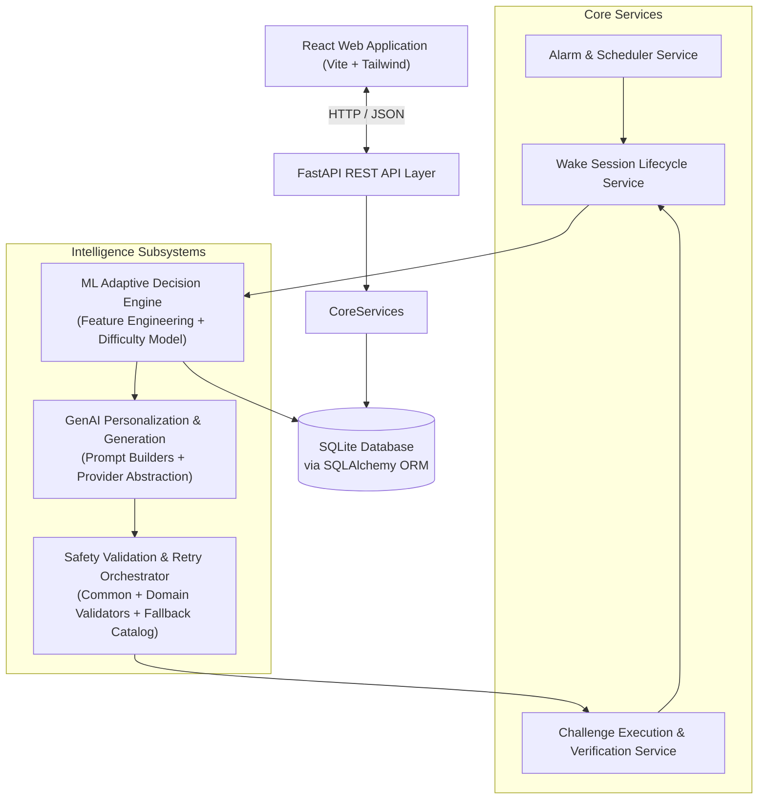

# SmartWake AI

SmartWake AI is an intelligent, personalized adaptive smart alarm clock engineered to combat sleep inertia and habitual snoozing. Unlike conventional alarms that can be dismissed with a subconscious swipe, SmartWake AI requires the user to successfully complete a cognitive or physical wake-up challenge before the alarm can be silenced.

The system combines machine learning for behavior-driven challenge difficulty adaptation with generative AI for dynamic, personalized challenge synthesis—safeguarded by a multi-tier validation, bounded retry, and deterministic offline fallback pipeline.

---

## 🎯 Project Objective

Traditional alarm clocks fail because dismissing them requires minimal cognitive engagement. SmartWake AI addresses this by:

1. **Enforcing Active Wakefulness:** Dismissal requires passing a verified cognitive or physical challenge.
2. **Preserving User Sovereignty:** The **user explicitly chooses their wake-up challenge type** and sets their desired alarm time. The system never overrides the user's selected challenge category or shifts their alarm schedule.
3. **Adaptive Personalization:** An ML decision engine analyzes historical snooze frequency, reaction times, and completion outcomes to dynamically adapt the **difficulty level** (`easy`, `medium`, `hard`) of the user's chosen challenge.
4. **Reliability-First Engineering:** GenAI-generated challenges undergo multi-stage safety validation and bounded retries, providing a reliable path to a validated deterministic offline fallback whenever provider or generation failures occur.

---

## ✨ Key Features

- **User-Selected Challenge Categories:** Users choose from 5 distinct challenge types aligned with their morning preferences.
- **ML-Driven Difficulty Adaptation:** Multi-class classification models evaluate pre-challenge behavioral and contextual signals to determine optimal difficulty.
- **Cold-Start & Sovereignty Guardrails:** A 7-tier fallback hierarchy provides sensible defaults for new users, while explicit user difficulty locks are strictly honored.
- **Dynamic GenAI Challenge Synthesis:** AI-powered question and task generation for Math, Memory, and Tongue Twister categories.
- **Cognitive Memory Recall (No Number Guessing):** Purpose-built memory challenges focusing on visual sequences, spatial patterns, dynamic paths, and symbol recall.
- **Multi-Layer Safety Boundary:** Sequential validation (Common + Domain-specific) guards against prompt injection, harmful instructions, unsolvable math, and exertion extremes.
- **Bounded Retries & Deterministic Fallback:** Strict retry bounds (`max_retries <= 2`) and 15 pre-verified offline catalog entries ensure challenge availability during provider outages.
- **Comprehensive Wake Session Telemetry:** Point-in-time logging of snooze intervals, challenge attempts, completion latencies, and adaptive decisions.

---

## 🎮 Wake-Up Challenge Types

The user chooses their preferred challenge type when creating or configuring an alarm:

| Challenge Type | Category | Core Mechanics | Key Safety & Bound Rules |
|---|---|---|---|
| **Math** | Cognitive / Arithmetic | Single expressions or multi-question arithmetic sets (addition, subtraction, multiplication, exact division). | No division by zero; strict operand and result bounds; authoritative Python-computed answer (LLM answers are never trusted). |
| **Memory** | Cognitive / Working Memory | Recall non-numeric sequences, spatial matrix patterns, dynamic spatial paths, or chronological symbol orders. | **Zero number-guessing.** Strictly non-numeric symbols and palettes; bounded sequence length per difficulty tier. |
| **Tongue Twister** | Verbal / Articulation | Aloud recitation of phonetically targeted alliterative phrases. | Controlled word counts (5–20 words); minimum sound density/alliteration thresholds; no raw numeric digits. |
| **Dance** | Physical / Kinetic | Timed procedural movement sequences with step cues, cadence guidelines, and tempo pacing. | Safe morning tempo limits (60–180 BPM); duration bounded to 10–120 seconds; maximum 30 steps. |
| **Push-ups** | Physical / Calisthenics | Repetition-based calisthenics with target counts, range-of-motion guidelines, and completion windows. | Exertion capped per difficulty tier (Easy $\le$ 15, Medium $\le$ 30, Hard $\le$ 50 reps); completion windows bounded to 15–180 seconds. |

> [!IMPORTANT]
> **Memory Challenges Are NOT Number Guessing:**
> Memory challenges evaluate spatial pattern recognition and working visual memory (e.g., color sequences, matrix cell lighting, path navigation, symbol orders). Numerical PIN guessing or digit recall is strictly rejected at the schema and validation boundary.

---

## 🧠 AI/ML Personalization

The machine learning subsystem personalizes the **difficulty** of the user's selected challenge based on historical waking telemetry:

- **Pre-Challenge Feature Signals:** Extracts behavioral features capturing global session history (completion rates, average wake delay), challenge-specific track records, session snooze fatigue, temporal context (alarm hour, day of week), and user settings.
- **Supervised Classification:** Multi-class models categorize waking friction into discrete difficulty tiers (`easy`, `medium`, `hard`).
- **Adaptive Decision Engine:** Balances model predictions against user preference locks, smoothing rules, and cold-start stages.
- **7-Level Fallback Hierarchy:** Traverses a structured fallback hierarchy (User-Fixed Preference $\to$ Cold Start Heuristics $\to$ ML Inference $\to$ Low-Confidence Fallback $\to$ Model/Telemetry Unavailable Fallbacks) to provide deterministic behavior when sufficient history, model inference, or telemetry is unavailable.

### Critical ML Invariants
- **User Challenge Choice is Sovereign:** The ML engine **never** decides whether the user gets Math, Dance, or Memory. It only determines how challenging that chosen category should be.
- **Alarm Schedule is Inviolable:** ML never shifts the user's configured alarm time.
- **Objective Difficulty Classification:** The ML target is optimal difficulty tier selection based on past waking struggle—not a simplistic "wake-up probability".
- **Zero Telemetry Fabrication:** Cold-start policies use deterministic defaults; synthetic data is never injected into runtime database logs.

---

## 🤖 Generative AI

SmartWake AI incorporates Generative AI to generate fresh, contextual, non-repetitive wake challenges:

- **Provider Abstraction:** Modular provider interface supporting `MockGenAIProvider` for fully offline development/testing and `GeminiGenAIProvider` for Google Gemini integration.
- **Independent Answer Authority:** The LLM is never trusted to calculate answers or evaluate correctness. Mathematical solutions, memory answer keys, and challenge-specific validation constraints are derived or enforced deterministically in Python.
- **Content Framework:** Standardized request/response envelopes with strict parameter typing.
- **Personalization Dispatcher:** Translates user behavioral profiles into category-specific generator arguments without leaking database identity.

---

## 🛡️ Safety & Reliability Pipeline

GenAI output is treated as untrusted and passes through a strict sequential safety boundary before reaching any alarm session:

```
Untrusted GenAI / Provider Output
               │
               ▼
┌──────────────────────────────────────────────┐
│ Stage 1: Common Output Validation            │
│ - Structural sanity & non-empty fields       │
│ - Strict type & difficulty immutability      │
│ - Control character & injection defense      │
│ - Deterministic harmful content guard        │
└──────────────────────┬───────────────────────┘
                       │ Pass
                       ▼
┌──────────────────────────────────────────────┐
│ Stage 2: Domain-Specific Safety Validation   │
│ - Math: solvability, bounds, no div/0        │
│ - Memory: non-numeric items, sequence bounds │
│ - Tongue Twister: alliteration, word limits  │
│ - Physical: repetition caps, duration bounds │
└──────────────────────┬───────────────────────┘
                       │
                       ├─── Valid ───────────────► Pass: Validated Content
                       │
                       └─── Invalid / Timeout ───► Bounded Retry (max 1-2 attempts)
                                                         │
                                                         └─── Exhausted ───► Deterministic Fallback
```

### Safety & Resilience Guarantees
- **No Silent Sanitization:** Invalid, malformed, or unsafe content is explicitly flagged with typed violation codes and rejected.
- **Bounded Retries:** Controlled by policy (`max_retries <= 2`, default 1). Infinite retry loops are structurally impossible.
- **Deterministic Offline Fallback:** Backed by an immutable catalog containing **15 pre-verified static fallback entries** (5 challenge types $\times$ 3 difficulty tiers). Every fallback entry is verified to pass common and domain safety rules with zero network and zero LLM calls.
- **Provider Failure Resilience:** Provider timeouts, rate limits, and outages are caught cleanly and routed to fallback. Raw exceptions and stack traces are never exposed in challenge content.
- **Privacy & PII Containment:** No user IDs, database models, session tokens, or personal identifiers enter or exit the GenAI boundary. Diagnostic notes pass through automated PII redaction filters.

---

## 🗄️ Database Architecture

The backend utilizes SQLite with SQLAlchemy ORM, organized around 7 core entities:

```
User (1) ────< Alarms (N)
  │                │
  │                └─────< WakeSessions (N) ────< SnoozeEvents (N)
  │                              │
  │                              ├────< ChallengeAttempts (N) >──── Challenge (Catalog)
  │                              │
  └──────────────────────────────┴────< MLAdaptiveLogs (N)
```

1. **`User`:** User account identity, timezone, and alarm preferences.
2. **`Alarm`:** Scheduled alarm configuration (time, recurrence pattern, active status, user-selected challenge type, and difficulty preference).
3. **`WakeSession`:** Tracks the lifecycle of an alarm session (`status`: `ringing`, `snoozed`, `in_challenge`, `completed`, `abandoned`).
4. **`SnoozeEvent`:** Granular behavioral telemetry capturing individual snooze events, timestamps, and durations.
5. **`Challenge`:** Master catalog template store defining challenge types, difficulty tiers, parameterized templates, and duration bounds.
6. **`ChallengeAttempt`:** Telemetry for each runtime attempt at solving a challenge within a wake session (attempt number, timings, user response, success status, verification score).
7. **`MLAdaptiveLog`:** Audit store recording pre-challenge historical feature snapshots, model policy versions, confidence scores, and final difficulty decisions.

---

## 🏗️ System Architecture



---

## 🛠️ Technology Stack

| Layer | Technologies |
|---|---|
| **Backend Framework** | Python, FastAPI, Uvicorn, Pydantic |
| **Database & ORM** | SQLite, SQLAlchemy |
| **Machine Learning** | scikit-learn, pandas, NumPy, joblib |
| **GenAI Providers** | Google Gemini API (configurable via `GENAI_MODEL`), Mock Provider (offline) |
| **Frontend Web App** | React, Vite, JavaScript, Tailwind CSS |
| **Testing & Verification** | Python `unittest`, Pyright (Static Analysis) |
| **Version Control** | Git, GitHub |

---

## 📂 Project Structure

```
SmartWake-AI/
├── backend/
│   ├── app/
│   │   ├── api/                  # FastAPI routers and route handlers
│   │   ├── core/                 # App configuration, constants, custom exceptions
│   │   ├── database/             # Database connection, session lifecycle, base model
│   │   ├── models/               # SQLAlchemy ORM models (User, Alarm, WakeSession, etc.)
│   │   ├── schemas/              # Pydantic schemas (requests, responses, safety contracts)
│   │   └── services/             # Application services
│   │       ├── adaptive_decision_engine.py       # ML runtime decision boundary
│   │       ├── alarm_service.py                  # Alarm scheduling & lifecycle management
│   │       ├── challenge_verification_service.py # Challenge solution verifiers
│   │       ├── personalization_dispatcher.py     # Personalization routing
│   │       ├── wake_session_service.py           # Wake session state machine
│   │       └── genai/                            # GenAI subsystem
│   │           ├── common_output_validator.py    # Common output safety boundary
│   │           ├── domain_safety_validator.py    # Domain-specific safety rules
│   │           ├── safety_retry_orchestrator.py  # Retry & deterministic fallback
│   │           ├── math_challenge_generator.py   # Math challenge generator
│   │           ├── memory_challenge_generator.py # Memory challenge generator
│   │           └── tongue_twister_challenge_generator.py # Tongue twister generator
│   ├── tests/                    # Comprehensive test suite (1036 tests)
│   └── requirements.txt          # Python dependencies
├── docs/                         # Technical & milestone documentation
│   ├── architecture/             # System diagrams, flows, and GenAI specs
│   ├── database/                 # Schema design specifications
│   ├── genai/                    # GenAI & safety validation specifications
│   └── ml/                       # ML feature engineering & training docs
├── frontend/                     # React web application
│   └── src/                      # UI components, pages, hooks, services
├── ml/                           # ML model training scripts, datasets, and pipelines
├── README.md                     # Root project documentation
└── pyproject.toml                # Project-level configuration
```

---

## 🚧 Development Progress

| Phase | Milestone | Description | Status |
| :---: | :--- | :--- | :---: |
| **1.0** | Core Foundation | SQLAlchemy ORM models, SQLite schema, session models | ✅ Completed |
| **2.0** | Scheduling & Verification | Alarm scheduler, session lifecycle state machine, solution verifiers | ✅ Completed |
| **3.0** | ML Feature Engineering | Behavioral features, point-in-time extraction, leakage defense | ✅ Completed |
| **3.1–3.4** | ML Training & Decision Engine | Difficulty classification pipeline, sovereign choice enforcement | ✅ Completed |
| **3.5–3.6** | Cold-Start & Runtime ML | 7-tier fallback hierarchy, offline evaluation, runtime integration | ✅ Completed |
| **4.0–4.1** | GenAI Foundation & Framework | Base provider abstraction, Mock provider, safe personalization context | ✅ Completed |
| **4.2–4.4** | Domain Challenge Generators | AI-generated Math, Memory (non-numeric), Tongue Twister generators | ✅ Completed |
| **4.5** | Challenge Personalization | Content schemas, repetition avoidance, personalization dispatcher | ✅ Completed |
| **4.6** | Safety, Retry & Fallback | Common/Domain validators, bounded retry, 15-entry fallback catalog | ✅ Completed |
| **4.7** | Runtime Ringing Integration | Connect GenAI generation to live alarm ringing session lifecycle | ⏳ *Planned* |
| **5.0** | Mobile & Vision Verification | Native mobile app, computer vision pose verification | 🔮 *Future Scope* |

---

## 🔑 Key Design Decisions

1. **User Sovereignty Over Challenge Category:** The user selects their challenge type. The AI system adapts the difficulty and parameters, never overriding the user's preferred challenge category.
2. **Alarm Time is Inviolable:** ML algorithms never change or delay the user's configured alarm time.
3. **Memory is Cognitive, Not Guesswork:** Memory challenges use spatial grids, visual sequences, and symbol patterns. PIN or number-guessing mechanics are strictly forbidden.
4. **LLM Answers Are Untrusted:** All mathematical evaluations, memory solution keys, and challenge-specific validation constraints are derived or enforced independently by deterministic Python logic.
5. **No Silent Sanitization:** Malformed or unsafe GenAI output is rejected with typed violation records rather than silently modified.
6. **Bounded Retry & Deterministic Fallback:** Uncontrolled retries are forbidden (`max_retries <= 2`). If generation fails or times out, a verified, difficulty-preserving offline challenge is returned.
7. **Stateless, Pure Validators:** Validation functions make zero database queries, network requests, or LLM calls.
8. **Strict Privacy Isolation:** No database models, user IDs, or PII ever cross the GenAI boundary.
9. **Web-First Architecture:** Developed as a web application first (React + FastAPI); mobile is planned as a future native extension.

---

## 🔮 Future Scope

- **Native Mobile Application:** Building mobile clients with platform-native background alarm capabilities and lock-screen dismissal guards.


---

## 📚 Documentation

For in-depth technical specifications, refer to the project documentation:

- **GenAI Architecture:** [docs/architecture/genai_architecture.md](docs/architecture/genai_architecture.md)
- **Personalized Challenge Content Framework:** [docs/architecture/personalized_challenge_content_framework.md](docs/architecture/personalized_challenge_content_framework.md)
- **AI Math Challenges:** [docs/architecture/ai_generated_math_challenges.md](docs/architecture/ai_generated_math_challenges.md)
- **AI Memory Challenges:** [docs/architecture/ai_generated_memory_challenges.md](docs/architecture/ai_generated_memory_challenges.md)
- **AI Tongue Twisters:** [docs/architecture/ai_generated_tongue_twisters.md](docs/architecture/ai_generated_tongue_twisters.md)
- **Phase 4.5 Personalization Pipeline:** [docs/genai/phase_4_5_personalization.md](docs/genai/phase_4_5_personalization.md)
- **Phase 4.6 Safety Validation & Fallback:** [docs/genai/phase_4_6_safety_validation_fallback.md](docs/genai/phase_4_6_safety_validation_fallback.md)
- **Machine Learning Subsystem:** [docs/ml/README.md](docs/ml/README.md)
- **Database Schema Design:** [docs/database/schema_design.md](docs/database/schema_design.md)
- **Project Repository:** [https://github.com/Vasudha1512/SmartWake-AI#smartwake-ai](https://github.com/Vasudha1512/SmartWake-AI#smartwake-ai)

---

## 🚀 Getting Started

### Prerequisites
- Python 3.10+ (Python 3.12 recommended)
- Node.js & npm (for frontend development)
- Git

### 1. Backend Setup
```bash
# Clone the repository
git clone https://github.com/Vasudha1512/SmartWake-AI.git
cd SmartWake-AI

# Create and activate a virtual environment
python -m venv .venv
# On Windows:
.\.venv\Scripts\activate
# On Linux/macOS:
source .venv/bin/activate

# Install dependencies
pip install -r backend/requirements.txt

# Configure environment variables
cp .env.example .env
```

### 2. Run the Backend Server
```bash
uvicorn backend.app.main:app --reload --port 8000
```
The API interactive documentation will be available at `http://localhost:8000/docs`.

### 3. Run the Test Suite
```bash
# Run the complete test suite (1036 tests)
python -m unittest discover -s backend/tests

# Run static type checking with Pyright
npx pyright
```

---

*SmartWake AI — Built with precision for reliable, intelligent, and safe morning wakefulness.*
