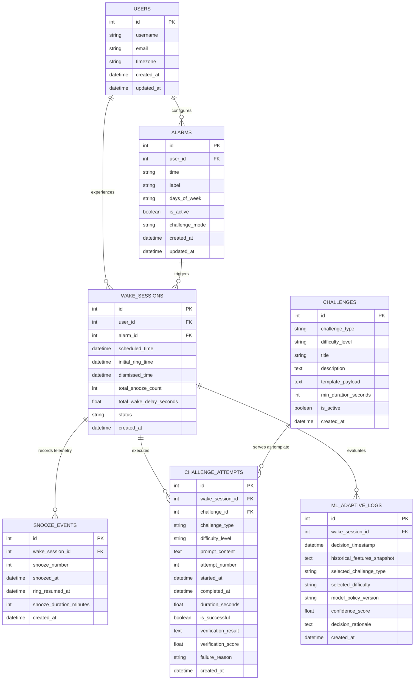

# SmartWake AI — Database Schema Design (Refined)

This document specifies the refined relational database schema for **SmartWake AI**, an adaptive smart alarm system designed to ensure users genuinely wake up by requiring the successful completion of an interactive cognitive or physical task before the alarm can be silenced.

---

## 1. Architectural Principles & Schema Overview

The database is designed around five core requirements:
1. **Full Wake-Up Lifecycle Tracking**: Every alarm event is modeled as a stateful, end-to-end session (`wake_sessions`) spanning initial trigger, snooze telemetry, challenge assignment, execution attempts, and final dismissal or failure.
2. **Catalog vs. Runtime Decoupling**: Master templates and configuration parameters live in `challenges`, while actual served prompts, user responses, timing, and verification outcomes live in `challenge_attempts`.
3. **Behavioral Telemetry**: Snoozing is modeled in `snooze_events` as behavioral telemetry (frequency, timing, and cumulative duration), providing high-fidelity inputs for adaptive intelligence.
4. **Substantial, Non-Trivial Challenges**: Challenges (notably Tongue Twister, Math, Memory, Dance, and Push-ups) are configured to prevent sleepy bypass. Specifically, Tongue Twister challenges are structured with substantial length and phonetic density across difficulty tiers to ensure true cognitive and verbal activation.
5. **Strict Data Leakage Prevention**: Feature inputs captured at challenge selection time are rigorously isolated from runtime attempt results.



---

## 2. Table Specifications & Relationships

### 2.1 Table: `users`
* **Purpose**: Manages user identity, account settings, and local timezone. Supports single-user local deployment while being fully prepared for multi-user capstone extensions.
* **Primary Key**: `id`

| Column | Data Type | Constraints | Description |
| :--- | :--- | :--- | :--- |
| `id` | `INTEGER` | `PRIMARY KEY AUTOINCREMENT` | Unique user identifier |
| `username` | `VARCHAR(50)` | `NOT NULL UNIQUE` | User display handle |
| `email` | `VARCHAR(120)` | `NULLABLE UNIQUE` | Optional user email |
| `timezone` | `VARCHAR(50)` | `NOT NULL DEFAULT 'UTC'` | User local timezone (e.g. `'Asia/Kolkata'`) |
| `created_at` | `DATETIME` | `NOT NULL DEFAULT CURRENT_TIMESTAMP` | Profile creation timestamp |
| `updated_at` | `DATETIME` | `NOT NULL DEFAULT CURRENT_TIMESTAMP` | Last profile update timestamp |

---

### 2.2 Table: `alarms`
* **Purpose**: Stores static alarm configurations created by the user, including target time, active days, and challenge policy.
* **Primary Key**: `id`
* **Foreign Keys**: `user_id` $\to$ `users(id)` (ON DELETE CASCADE)

| Column | Data Type | Constraints | Description |
| :--- | :--- | :--- | :--- |
| `id` | `INTEGER` | `PRIMARY KEY AUTOINCREMENT` | Unique alarm ID |
| `user_id` | `INTEGER` | `NOT NULL, FOREIGN KEY` | Owner ID referencing `users(id)` |
| `time` | `VARCHAR(5)` | `NOT NULL` | Scheduled time in 24-hour format (`"HH:MM"`) |
| `label` | `VARCHAR(100)` | `NULLABLE DEFAULT 'Alarm'` | Custom label (e.g., "Weekday Routine") |
| `days_of_week` | `VARCHAR(50)` | `NOT NULL DEFAULT '[0,1,2,3,4]'` | JSON array of active days (`0` = Mon, `6` = Sun) |
| `is_active` | `BOOLEAN` | `NOT NULL DEFAULT 1` | Alarm active switch |
| `challenge_mode`| `VARCHAR(20)` | `NOT NULL DEFAULT 'adaptive'` | Policy: `'adaptive'` (AI-selected) or `'manual'` |
| `created_at` | `DATETIME` | `NOT NULL DEFAULT CURRENT_TIMESTAMP` | Alarm creation timestamp |
| `updated_at` | `DATETIME` | `NOT NULL DEFAULT CURRENT_TIMESTAMP` | Last modification timestamp |

---

### 2.3 Table: `wake_sessions`
* **Purpose**: Represents one complete, end-to-end alarm-to-success/failure wake-up lifecycle. Tracks state transitions from initial scheduled trigger, through snooze cycles and challenge attempts, to final resolution.
* **Primary Key**: `id`
* **Foreign Keys**: 
  * `user_id` $\to$ `users(id)` (ON DELETE CASCADE)
  * `alarm_id` $\to$ `alarms(id)` (ON DELETE SET NULL)

| Column | Data Type | Constraints | Description |
| :--- | :--- | :--- | :--- |
| `id` | `INTEGER` | `PRIMARY KEY AUTOINCREMENT` | Unique session ID |
| `user_id` | `INTEGER` | `NOT NULL, FOREIGN KEY` | Reference to `users(id)` |
| `alarm_id` | `INTEGER` | `NULLABLE, FOREIGN KEY` | Reference to triggering `alarms(id)` |
| `scheduled_time` | `DATETIME` | `NOT NULL` | Planned alarm firing time |
| `initial_ring_time`| `DATETIME`| `NOT NULL` | Actual timestamp when audio first triggered |
| `dismissed_time` | `DATETIME` | `NULLABLE` | Timestamp when user passed challenge and stopped alarm |
| `total_snooze_count` | `INTEGER` | `NOT NULL DEFAULT 0` | Cumulative snoozes taken during this session |
| `total_wake_delay_seconds` | `FLOAT` | `NULLABLE` | Total elapsed seconds between `scheduled_time` and `dismissed_time` |
| `status` | `VARCHAR(20)`| `NOT NULL DEFAULT 'ringing'` | Lifecycle state: `'ringing'`, `'snoozed'`, `'in_challenge'`, `'completed'`, `'abandoned'` |
| `created_at` | `DATETIME` | `NOT NULL DEFAULT CURRENT_TIMESTAMP` | Session start timestamp |

---

### 2.4 Table: `snooze_events`
* **Purpose**: Captures snooze behavior telemetry. Each row records an individual snooze interaction, capturing exact timing, sequence order, and snooze window length.
* **Primary Key**: `id`
* **Foreign Keys**: `wake_session_id` $\to$ `wake_sessions(id)` (ON DELETE CASCADE)

| Column | Data Type | Constraints | Description |
| :--- | :--- | :--- | :--- |
| `id` | `INTEGER` | `PRIMARY KEY AUTOINCREMENT` | Unique snooze event ID |
| `wake_session_id` | `INTEGER` | `NOT NULL, FOREIGN KEY` | Reference to active `wake_sessions(id)` |
| `snooze_number` | `INTEGER` | `NOT NULL` | Sequential snooze index in current session (1, 2, 3...) |
| `snoozed_at` | `DATETIME` | `NOT NULL` | Timestamp when Snooze button was pressed |
| `ring_resumed_at` | `DATETIME` | `NULLABLE` | Timestamp when alarm resumed ringing |
| `snooze_duration_minutes` | `INTEGER` | `NOT NULL DEFAULT 5` | Configured duration for this snooze interval |
| `created_at` | `DATETIME` | `NOT NULL DEFAULT CURRENT_TIMESTAMP` | Event record timestamp |

---

### 2.5 Table: `challenges`
* **Purpose**: Master catalog and template definition store for challenge types and difficulty tiers. Runtime challenge instances are generated from these templates rather than storing every live instance here.
* **Primary Key**: `id`

| Column | Data Type | Constraints | Description |
| :--- | :--- | :--- | :--- |
| `id` | `INTEGER` | `PRIMARY KEY AUTOINCREMENT` | Unique challenge template ID |
| `challenge_type` | `VARCHAR(30)` | `NOT NULL` | Category: `'dance'`, `'math'`, `'memory'`, `'tongue_twister'`, `'push_ups'` |
| `difficulty_level`| `VARCHAR(20)` | `NOT NULL` | Tier: `'easy'`, `'medium'`, `'hard'` |
| `title` | `VARCHAR(100)`| `NOT NULL` | Template title (e.g., "Phonetic Sibilant Twister - Medium") |
| `description` | `TEXT` | `NOT NULL` | General user instructions |
| `template_payload` | `TEXT (JSON)` | `NOT NULL` | Structural configuration & parameters for runtime generation |
| `min_duration_seconds` | `INTEGER` | `NOT NULL DEFAULT 10` | Expected minimum engagement time |
| `is_active` | `BOOLEAN` | `NOT NULL DEFAULT 1` | Availability flag |
| `created_at` | `DATETIME` | `NOT NULL DEFAULT CURRENT_TIMESTAMP` | Template creation timestamp |

---

### 2.6 Table: `challenge_attempts`
* **Purpose**: Stores the actual runtime challenge execution during a wake session, recording the generated prompt, attempt count, start/finish times, success outcome, and verification telemetry.
* **Primary Key**: `id`
* **Foreign Keys**: 
  * `wake_session_id` $\to$ `wake_sessions(id)` (ON DELETE CASCADE)
  * `challenge_id` $\to$ `challenges(id)` (ON DELETE SET NULL)

| Column | Data Type | Constraints | Description |
| :--- | :--- | :--- | :--- |
| `id` | `INTEGER` | `PRIMARY KEY AUTOINCREMENT` | Unique attempt execution ID |
| `wake_session_id` | `INTEGER` | `NOT NULL, FOREIGN KEY` | Reference to parent `wake_sessions(id)` |
| `challenge_id` | `INTEGER` | `NULLABLE, FOREIGN KEY` | Reference to template in `challenges(id)` |
| `challenge_type` | `VARCHAR(30)` | `NOT NULL` | Executed category (`'dance'`, `'math'`, `'memory'`, `'tongue_twister'`, `'push_ups'`) |
| `difficulty_level`| `VARCHAR(20)` | `NOT NULL` | Difficulty served (`'easy'`, `'medium'`, `'hard'`) |
| `prompt_content` | `TEXT (JSON)` | `NOT NULL` | Actual generated challenge payload presented to the user |
| `attempt_number` | `INTEGER` | `NOT NULL DEFAULT 1` | Submission attempt number (1 for first try, 2+ for retries) |
| `started_at` | `DATETIME` | `NOT NULL` | Timestamp when challenge prompt was displayed |
| `completed_at` | `DATETIME` | `NULLABLE` | Timestamp when user submitted or completed the task |
| `duration_seconds` | `FLOAT` | `NULLABLE` | Total elapsed seconds to finish the task |
| `is_successful` | `BOOLEAN` | `NULLABLE` | `1` = Task passed, `0` = Task failed/timed out |
| `verification_result` | `TEXT (JSON)` | `NULLABLE` | Raw verification telemetry (transcription, CV reps, accuracy) |
| `verification_score` | `FLOAT` | `NULLABLE` | Normalized score between `0.0` and `1.0` |
| `failure_reason` | `VARCHAR(100)`| `NULLABLE` | Diagnostic (e.g., `'pronunciation_mismatch'`, `'wrong_answer'`, `'timeout'`) |
| `created_at` | `DATETIME` | `NOT NULL DEFAULT CURRENT_TIMESTAMP` | Record creation timestamp |

---

### 2.7 Table: `ml_adaptive_logs`
* **Purpose**: Auditing and ML training dataset store. Records the exact historical feature vector available at the moment of decision, the model/policy version, the assigned task, confidence score, and decision rationale.
* **Primary Key**: `id`
* **Foreign Keys**: `wake_session_id` $\to$ `wake_sessions(id)` (ON DELETE CASCADE)

| Column | Data Type | Constraints | Description |
| :--- | :--- | :--- | :--- |
| `id` | `INTEGER` | `PRIMARY KEY AUTOINCREMENT` | Unique decision log ID |
| `wake_session_id` | `INTEGER` | `NOT NULL, FOREIGN KEY` | Reference to `wake_sessions(id)` |
| `decision_timestamp` | `DATETIME` | `NOT NULL DEFAULT CURRENT_TIMESTAMP` | Exact time the adaptive decision was made |
| `historical_features_snapshot` | `TEXT (JSON)` | `NOT NULL` | Serialized JSON of all historical features used for the decision |
| `selected_challenge_type` | `VARCHAR(30)` | `NOT NULL` | Challenge category chosen by model/policy |
| `selected_difficulty` | `VARCHAR(20)` | `NOT NULL` | Difficulty tier chosen by model/policy |
| `model_policy_version` | `VARCHAR(50)` | `NOT NULL` | Model checkpoint or heuristic policy version |
| `confidence_score` | `FLOAT` | `NULLABLE` | Model confidence probability (0.0 to 1.0) |
| `decision_rationale` | `TEXT` | `NULLABLE` | Explainable reason or rule trace for the decision |
| `created_at` | `DATETIME` | `NOT NULL DEFAULT CURRENT_TIMESTAMP` | Record timestamp |

---

## 3. Specifications for Supported Challenge Types

The schema stores template parameters in `challenges.template_payload` and runtime instances in `challenge_attempts.prompt_content` across all 5 mandatory types:

| Challenge Type | Master Template Payload (`challenges`) | Runtime Attempt Payload (`challenge_attempts`) | Verification Telemetry (`verification_result`) |
| :--- | :--- | :--- | :--- |
| **Math** | Allowed operators (`+`, `-`, `*`), digit bounds, number of steps | `{"question": "34 + 57 - 18", "answer": 73}` | `{"user_answer": 73, "is_match": true}` |
| **Memory** | Grid dimensions ($3 \times 3$, $4 \times 4$), sequence length (5–8 items), visual pattern tokens *(strictly non-number guessing)* | `{"sequence": ["blue_circle", "red_square", "green_triangle", ...], "display_time_ms": 3000}` | `{"matched_count": 6, "total": 6, "mistakes": 0}` |
| **Tongue Twister** | Difficulty tiers, minimum word count bounds, phonetic complexity tier, reference text bank | `{"target_sentence": "...", "min_word_count": 24, "phonetic_focus": "sibilants"}` | `{"transcribed_text": "...", "word_error_rate": 0.08, "phonetic_match": 0.92}` |
| **Dance** | Target choreography routine, movement sequence, required active duration (15–30s) | `{"routine": "side_step_arms_up", "target_duration_seconds": 20}` | `{"movement_detected": true, "motion_energy_score": 0.84}` |
| **Push-ups** | Target repetition range (5–15), cadence threshold, body posture guide | `{"target_reps": 10, "form_check": "chest_to_floor"}` | `{"reps_detected": 10, "avg_depth_score": 0.91}` |

---

## 4. In-Depth Tongue Twister Challenge Design

### 4.1 Anti-Bypass Principle
A short 3–4 word phrase (e.g. *"Red lorry, yellow lorry"*) is trivial and can be mumbled in two seconds without forcing genuine alertness. SmartWake AI enforces **substantial sentence length and phonetic friction** so that a sleepy user must actively articulate complex sound sequences, stimulating the brainstem and respiratory system.

### 4.2 Difficulty Progression Strategy
Difficulty scales through **sentence length**, **multi-clause syntactic structure**, and **confusing phonetic transitions** (alternating sibilants, plosives, and liquids) rather than merely increasing attempt repetitions:

* **Easy Tier (Moderately Long Sentence — 14 to 18 Words)**:
  * *Focus*: Steady phonetic repetition with single-clause rhythm.
  * *Template Parameters*: `min_words: 14`, `max_error_rate: 0.15`.
  * *Example*: *"How much wood would a woodchuck chuck if a woodchuck could chuck wood? As much wood as a woodchuck would."*
* **Medium Tier (Complex Sentence — 22 to 32 Words)**:
  * *Focus*: Confusing phonetic shifts (e.g. `/s/` vs. `/ʃ/`, or `/b/` vs. `/p/`) with multiple dependent clauses.
  * *Template Parameters*: `min_words: 22`, `max_error_rate: 0.12`.
  * *Example*: *"She sells sea shells by the sea shore, and the shells she sells are sea shells for sure, so if she sells sea shells on the sea shore, where are the sea shells she sells?"*
* **Hard Tier (Substantially Long Passage — 36 to 55+ Words)**:
  * *Focus*: Multi-sentence compound passage with high phonetic friction and rhythm disruptions.
  * *Template Parameters*: `min_words: 36`, `max_error_rate: 0.10`.
  * *Example*: *"Peter Piper picked a peck of pickled peppers. A peck of pickled peppers Peter Piper picked. If Peter Piper picked a peck of pickled peppers, where is the peck of pickled peppers that Peter Piper picked? Betty Botter bought some bitter butter and beat it into her batter."*

### 4.3 Database Representation for Tongue Twister Attempts
In `challenge_attempts`:
```json
{
  "prompt_content": {
    "target_passage": "She sells sea shells by the sea shore, and the shells she sells are sea shells for sure, so if she sells sea shells on the sea shore, where are the sea shells she sells?",
    "word_count": 34,
    "phonetic_clusters": ["sh", "s"],
    "minimum_spoken_duration_seconds": 8.0
  },
  "verification_result": {
    "transcribed_speech": "She sells sea shells by the sea shore and the shells she sells are sea shells for sure...",
    "word_error_rate": 0.06,
    "similarity_percentage": 94.2,
    "spoken_duration_seconds": 9.4
  }
}
```

---

## 5. Machine Learning Telemetry & Data Leakage Prevention

### 5.1 The Fundamental Distinction: Selection Inputs vs. Runtime Outcomes

To train a valid adaptive model, there must be an absolute boundary between **what is known when choosing the challenge** and **what happens while executing the challenge**:

```
┌────────────────────────────────────────────────────────────────────────┐
│                        PREDICTION / SELECTION TIME                     │
│                        (Allowed Historical Inputs)                     │
├────────────────────────────────────────────────────────────────────────┤
│  1. Calendar & Temporal Context:                                       │
│     - scheduled_hour, scheduled_minute                                 │
│     - day_of_week (0–6), is_weekend                                    │
│                                                                        │
│  2. Current Session Pre-Challenge State:                               │
│     - total_snooze_count_before_challenge (from current session)       │
│     - current_session_wake_delay_so_far                                │
│                                                                        │
│  3. Historical Aggregates (Prior Sessions Only):                       │
│     - rolling_avg_snoozes_7d                                           │
│     - hist_success_rate_per_challenge_type                             │
│       (e.g., Math: 92%, Push-ups: 45%, TongueTwister: 80%)             │
│     - hist_avg_duration_per_challenge_type                            │
│     - last_session_outcome (success/failure of prior day)              │
└───────────────────────────────────┬────────────────────────────────────┘
                                    │
                                    ▼ (ML Policy selects challenge & difficulty)
┌────────────────────────────────────────────────────────────────────────┐
│                        RUNTIME CHALLENGE EXECUTION                     │
│               (Post-Event Target Data - STRICTLY FORBIDDEN             │
│                      as inputs for this selection)                     │
├────────────────────────────────────────────────────────────────────────┤
│  - challenge_attempts.is_successful                                    │
│  - challenge_attempts.duration_seconds                                 │
│  - challenge_attempts.verification_score                               │
│  - challenge_attempts.verification_result                              │
│  - challenge_attempts.failure_reason                                   │
│  - wake_sessions.dismissed_time                                        │
│  - wake_sessions.total_wake_delay_seconds                              │
│  - wake_sessions.status ('completed' or 'abandoned')                   │
└────────────────────────────────────────────────────────────────────────┘
```

### 5.2 Role of `ml_adaptive_logs` in Guaranteeing Leak-Free Training
`ml_adaptive_logs.historical_features_snapshot` freezes the exact feature dictionary at the millisecond the decision is made. 

When training or retraining the ML model in future phases:
* The training features $X$ are loaded directly from `ml_adaptive_logs.historical_features_snapshot`.
* The training target $y$ is extracted from `challenge_attempts.is_successful` or `wake_sessions.total_wake_delay_seconds`.
* This mathematical decoupling completely eliminates the risk of future data leakage.

---

## 6. Complete Lifecycle Walkthrough

```
[07:00:00 AM] Alarm Fires
  └── wake_sessions: Insert row #201 (scheduled=07:00, initial_ring=07:00:01, status='ringing')

[07:00:30 AM] User Hits Snooze (First Time)
  ├── snooze_events: Insert row (wake_session_id=201, snooze_number=1, duration=5m)
  └── wake_sessions: Update #201 (total_snooze_count=1, status='snoozed')

[07:05:30 AM] Alarm Rings Again -> User Hits Snooze (Second Time)
  ├── snooze_events: Insert row (wake_session_id=201, snooze_number=2, duration=5m)
  └── wake_sessions: Update #201 (total_snooze_count=2, status='snoozed')

[07:10:30 AM] Alarm Rings Again -> User Initiates Challenge
  └── wake_sessions: Update #201 (status='in_challenge')

[07:10:31 AM] Adaptive Selection Policy Triggers
  ├── Extracts features: [hour=7, day=Monday, current_snoozes=2, hist_tt_success=0.85, hist_math_success=0.90]
  ├── Heuristic/ML evaluates: High inertia (2 snoozes on Monday morning) -> escalate to verbal activation!
  ├── Policy Decision: challenge_type='tongue_twister', difficulty='medium'
  └── ml_adaptive_logs: Insert row (session=201, type='tongue_twister', diff='medium', rationale='High snooze count on Monday morning requires active verbal stimulation.')

[07:10:33 AM] Challenge Prompt Generated & Displayed
  └── challenge_attempts: Insert row #801 (session=201, type='tongue_twister', diff='medium', 
                          prompt='She sells sea shells by the sea shore...', started_at=07:10:33)

[07:11:05 AM] User Speaks Passage & System Verifies Audio
  └── challenge_attempts: Update #801 (completed_at=07:11:05, duration_seconds=32.0, 
                          is_successful=1, verification_score=0.94, failure_reason=NULL)

[07:11:05 AM] Alarm Silenced & Session Resolved
  └── wake_sessions: Finalize #201 (dismissed_time=07:11:05, total_wake_delay_seconds=665.0, status='completed')
```

---

## 7. Entity Justification Summary

1. **`users`**: Provides identity and timezone boundaries for all timestamps and schedules.
2. **`alarms`**: Stores repeating schedule rules without cluttering daily session state.
3. **`wake_sessions`**: The central state machine orchestrating the alarm-to-completion lifecycle.
4. **`snooze_events`**: Stores granular snooze behavioral telemetry (timing and frequency) to model inertia patterns.
5. **`challenges`**: Acts as the master template catalog, keeping task configurations clean and decoupled from runtime logic.
6. **`challenge_attempts`**: Records live execution telemetry (prompts, times, verification metrics, outcomes) across all 5 challenge categories.
7. **`ml_adaptive_logs`**: Preserves point-in-time feature snapshots to guarantee zero data leakage during ML training and explainability audits.
