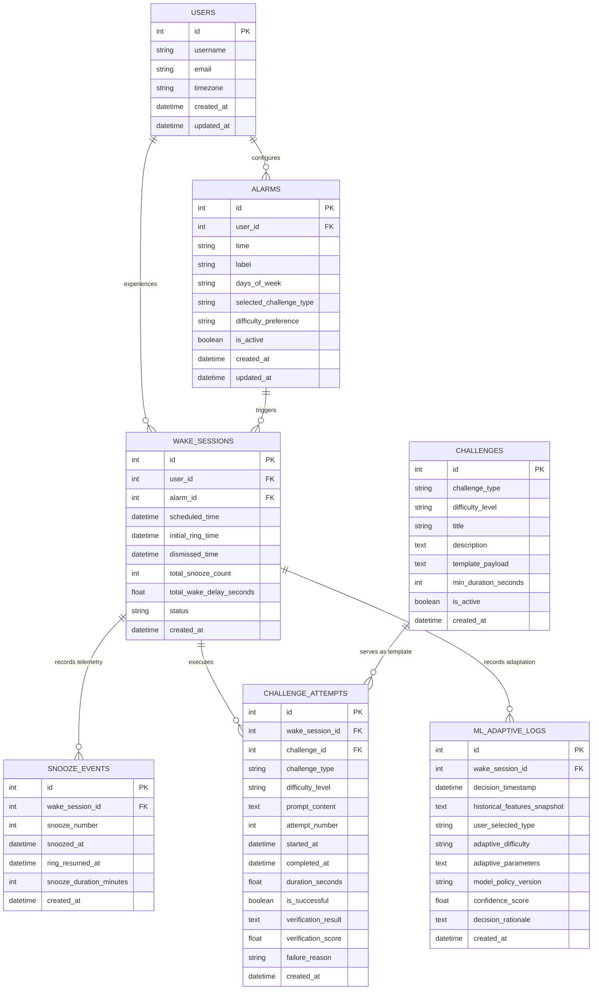

# SmartWake AI — Database Schema Design (Refined & Corrected)

This document specifies the relational database schema for **SmartWake AI**, an adaptive smart alarm system that guarantees users wake up by requiring the successful completion of an interactive task before the alarm is dismissed.

---

## 1. Core Architectural & Product Rules

### 1.1 The Cardinal Product Rule: User Choice vs. ML Adaptation

> [!IMPORTANT]
> **PRODUCT RULE: The USER chooses the wake-up task type when creating the alarm. The ML system NEVER selects or overrides the task type.**

* **USER INPUT (Explicit Configuration)**:
  * **Alarm Time**: Target scheduled time (e.g. `07:00 AM`). The ML system never modifies the user's scheduled time.
  * **Selected Challenge Type**: The user chooses from the 5 mandatory categories: **Dance**, **Math**, **Memory**, **Tongue Twister**, or **Push-ups**.
  * **Difficulty Preference**: Baseline tier (`'adaptive'`, `'easy'`, `'medium'`, `'hard'`).
* **ML ADAPTATION (Intelligent Tuning)**:
  * The ML system **only adapts the user's selected task**, tailoring:
    1. **Adaptive Difficulty**: Tuning between `'easy'`, `'medium'`, and `'hard'` based on past inertia and success rate.
    2. **Adaptive Parameters**: Setting specific bounds (e.g., passage word count, phonetic complexity, arithmetic operand ranges, rep counts).
    3. **Generated Content**: Synthesizing or retrieving fresh personalized challenges within the user's chosen task type.
    4. **Verification Thresholds**: Calibrating speech-to-text accuracy or computer vision repetition depth requirements.

---

## 2. Entity-Relationship Overview



---

## 3. Detailed Table Specifications

### 3.1 Table: `users`
* **Purpose**: Manages user identity, account settings, and local timezone. Supports single-user local deployment while being fully prepared for multi-user capstone extensions.
* **Primary Key**: `id`

| Column | Data Type | Constraints | Description |
| :--- | :--- | :--- | :--- |
| `id` | `INTEGER` | `PRIMARY KEY AUTOINCREMENT` | Unique user identifier |
| `username` | `VARCHAR(50)` | `NOT NULL UNIQUE` | User display handle |
| `email` | `VARCHAR(120)` | `NULLABLE UNIQUE` | Optional user email |
| `timezone` | `VARCHAR(50)` | `NOT NULL DEFAULT 'UTC'` | User local timezone (e.g. `'Asia/Kolkata'`) |
| `created_at` | `DATETIME` | `NOT NULL DEFAULT CURRENT_TIMESTAMP` | Profile creation timestamp |
| `updated_at` | `DATETIME` | `NOT NULL DEFAULT CURRENT_TIMESTAMP` | Last profile update timestamp |

---

### 3.2 Table: `alarms`
* **Purpose**: Stores static alarm configurations created by the user, including target wake time, active days, and **the user's chosen challenge type**.
* **Primary Key**: `id`
* **Foreign Keys**: `user_id` $\to$ `users(id)` (ON DELETE CASCADE)

| Column | Data Type | Constraints | Description |
| :--- | :--- | :--- | :--- |
| `id` | `INTEGER` | `PRIMARY KEY AUTOINCREMENT` | Unique alarm ID |
| `user_id` | `INTEGER` | `NOT NULL, FOREIGN KEY` | Owner ID referencing `users(id)` |
| `time` | `VARCHAR(5)` | `NOT NULL` | **USER INPUT**: Scheduled time in 24h format (`"HH:MM"`) |
| `label` | `VARCHAR(100)` | `NULLABLE DEFAULT 'Alarm'` | Custom label (e.g., "Morning Workout") |
| `days_of_week` | `VARCHAR(50)` | `NOT NULL DEFAULT '[0,1,2,3,4]'` | JSON array of active days (`0` = Mon, `6` = Sun) |
| `selected_challenge_type` | `VARCHAR(30)` | `NOT NULL DEFAULT 'tongue_twister'` | **USER INPUT**: Explicitly selected task (`'dance'`, `'math'`, `'memory'`, `'tongue_twister'`, `'push_ups'`) |
| `difficulty_preference` | `VARCHAR(20)` | `NOT NULL DEFAULT 'adaptive'` | **USER INPUT**: `'adaptive'` (let ML tune difficulty), or manual lock (`'easy'`, `'medium'`, `'hard'`) |
| `is_active` | `BOOLEAN` | `NOT NULL DEFAULT 1` | Master alarm toggle switch |
| `created_at` | `DATETIME` | `NOT NULL DEFAULT CURRENT_TIMESTAMP` | Alarm creation timestamp |
| `updated_at` | `DATETIME` | `NOT NULL DEFAULT CURRENT_TIMESTAMP` | Last modification timestamp |

---

### 3.3 Table: `wake_sessions`
* **Purpose**: Represents one complete, end-to-end alarm-to-success/failure wake-up lifecycle. Tracks state transitions from initial scheduled trigger, through snooze cycles and challenge attempts, to final resolution.
* **Primary Key**: `id`
* **Foreign Keys**: 
  * `user_id` $\to$ `users(id)` (ON DELETE CASCADE)
  * `alarm_id` $\to$ `alarms(id)` (ON DELETE SET NULL)

| Column | Data Type | Constraints | Description |
| :--- | :--- | :--- | :--- |
| `id` | `INTEGER` | `PRIMARY KEY AUTOINCREMENT` | Unique session ID |
| `user_id` | `INTEGER` | `NOT NULL, FOREIGN KEY` | Reference to `users(id)` |
| `alarm_id` | `INTEGER` | `NULLABLE, FOREIGN KEY` | Reference to triggering `alarms(id)` |
| `scheduled_time` | `DATETIME` | `NOT NULL` | Planned alarm firing time |
| `initial_ring_time`| `DATETIME`| `NOT NULL` | Actual timestamp when audio first triggered |
| `dismissed_time` | `DATETIME` | `NULLABLE` | Timestamp when user passed challenge and stopped alarm |
| `total_snooze_count` | `INTEGER` | `NOT NULL DEFAULT 0` | Cumulative snoozes taken during this session |
| `total_wake_delay_seconds` | `FLOAT` | `NULLABLE` | Total elapsed seconds between `scheduled_time` and `dismissed_time` |
| `status` | `VARCHAR(20)`| `NOT NULL DEFAULT 'ringing'` | Lifecycle state: `'ringing'`, `'snoozed'`, `'in_challenge'`, `'completed'`, `'abandoned'` |
| `created_at` | `DATETIME` | `NOT NULL DEFAULT CURRENT_TIMESTAMP` | Session start timestamp |

---

### 3.4 Table: `snooze_events`
* **Purpose**: Captures snooze behavior telemetry. Each row records an individual snooze interaction, capturing exact timing, sequence order, and snooze window length.
* **Primary Key**: `id`
* **Foreign Keys**: `wake_session_id` $\to$ `wake_sessions(id)` (ON DELETE CASCADE)

| Column | Data Type | Constraints | Description |
| :--- | :--- | :--- | :--- |
| `id` | `INTEGER` | `PRIMARY KEY AUTOINCREMENT` | Unique snooze event ID |
| `wake_session_id` | `INTEGER` | `NOT NULL, FOREIGN KEY` | Reference to active `wake_sessions(id)` |
| `snooze_number` | `INTEGER` | `NOT NULL` | Sequential snooze index in current session (1, 2, 3...) |
| `snoozed_at` | `DATETIME` | `NOT NULL` | Timestamp when Snooze button was pressed |
| `ring_resumed_at` | `DATETIME` | `NULLABLE` | Timestamp when alarm resumed ringing |
| `snooze_duration_minutes` | `INTEGER` | `NOT NULL DEFAULT 5` | Configured duration for this snooze interval |
| `created_at` | `DATETIME` | `NOT NULL DEFAULT CURRENT_TIMESTAMP` | Event record timestamp |

---

### 3.5 Table: `challenges`
* **Purpose**: Master catalog and template definition store for challenge types and difficulty tiers. Runtime challenge instances are generated from these templates rather than storing every live instance here.
* **Primary Key**: `id`

| Column | Data Type | Constraints | Description |
| :--- | :--- | :--- | :--- |
| `id` | `INTEGER` | `PRIMARY KEY AUTOINCREMENT` | Unique challenge template ID |
| `challenge_type` | `VARCHAR(30)` | `NOT NULL` | Category: `'dance'`, `'math'`, `'memory'`, `'tongue_twister'`, `'push_ups'` |
| `difficulty_level`| `VARCHAR(20)` | `NOT NULL` | Tier: `'easy'`, `'medium'`, `'hard'` |
| `title` | `VARCHAR(100)`| `NOT NULL` | Template title (e.g., "Phonetic Sibilant Twister - Medium") |
| `description` | `TEXT` | `NOT NULL` | General user instructions |
| `template_payload` | `TEXT (JSON)` | `NOT NULL` | Structural configuration & parameters for runtime generation |
| `min_duration_seconds` | `INTEGER` | `NOT NULL DEFAULT 10` | Expected minimum engagement time |
| `is_active` | `BOOLEAN` | `NOT NULL DEFAULT 1` | Availability flag |
| `created_at` | `DATETIME` | `NOT NULL DEFAULT CURRENT_TIMESTAMP` | Template creation timestamp |

---

### 3.6 Table: `challenge_attempts`
* **Purpose**: Stores the actual runtime challenge execution during a wake session, recording the generated prompt, attempt count, start/finish times, success outcome, and verification telemetry.
* **Primary Key**: `id`
* **Foreign Keys**: 
  * `wake_session_id` $\to$ `wake_sessions(id)` (ON DELETE CASCADE)
  * `challenge_id` $\to$ `challenges(id)` (ON DELETE SET NULL)

| Column | Data Type | Constraints | Description |
| :--- | :--- | :--- | :--- |
| `id` | `INTEGER` | `PRIMARY KEY AUTOINCREMENT` | Unique attempt execution ID |
| `wake_session_id` | `INTEGER` | `NOT NULL, FOREIGN KEY` | Reference to parent `wake_sessions(id)` |
| `challenge_id` | `INTEGER` | `NULLABLE, FOREIGN KEY` | Reference to template in `challenges(id)` |
| `challenge_type` | `VARCHAR(30)` | `NOT NULL` | User's chosen category (`'dance'`, `'math'`, `'memory'`, `'tongue_twister'`, `'push_ups'`) |
| `difficulty_level`| `VARCHAR(20)` | `NOT NULL` | ML-adapted difficulty level served (`'easy'`, `'medium'`, `'hard'`) |
| `prompt_content` | `TEXT (JSON)` | `NOT NULL` | Actual generated challenge payload presented to the user |
| `attempt_number` | `INTEGER` | `NOT NULL DEFAULT 1` | Submission attempt number (1 for first try, 2+ for retries) |
| `started_at` | `DATETIME` | `NOT NULL` | Timestamp when challenge prompt was displayed |
| `completed_at` | `DATETIME` | `NULLABLE` | Timestamp when user submitted or completed the task |
| `duration_seconds` | `FLOAT` | `NULLABLE` | Total elapsed seconds to finish the task |
| `is_successful` | `BOOLEAN` | `NULLABLE` | `1` = Task passed, `0` = Task failed/timed out |
| `verification_result` | `TEXT (JSON)` | `NULLABLE` | Raw verification telemetry (transcription, CV reps, accuracy) |
| `verification_score` | `FLOAT` | `NULLABLE` | Normalized score between `0.0` and `1.0` |
| `failure_reason` | `VARCHAR(100)`| `NULLABLE` | Diagnostic (e.g., `'pronunciation_mismatch'`, `'wrong_answer'`, `'timeout'`) |
| `created_at` | `DATETIME` | `NOT NULL DEFAULT CURRENT_TIMESTAMP` | Record creation timestamp |

---

### 3.7 Table: `ml_adaptive_logs`
* **Purpose**: Auditing and ML training dataset store. Records the exact historical feature vector available at the moment of decision, the model/policy version, the assigned task, confidence score, and decision rationale.
* **Primary Key**: `id`
* **Foreign Keys**: `wake_session_id` $\to$ `wake_sessions(id)` (ON DELETE CASCADE)

| Column | Data Type | Constraints | Description |
| :--- | :--- | :--- | :--- |
| `id` | `INTEGER` | `PRIMARY KEY AUTOINCREMENT` | Unique decision log ID |
| `wake_session_id` | `INTEGER` | `NOT NULL, FOREIGN KEY` | Reference to `wake_sessions(id)` |
| `decision_timestamp` | `DATETIME` | `NOT NULL DEFAULT CURRENT_TIMESTAMP` | Exact time the adaptive decision was made |
| `historical_features_snapshot` | `TEXT (JSON)` | `NOT NULL` | Serialized JSON of all historical features used for the decision |
| `user_selected_type` | `VARCHAR(30)` | `NOT NULL` | **USER CHOICE**: The task type chosen by the user in alarm configuration |
| `adaptive_difficulty` | `VARCHAR(20)` | `NOT NULL` | **ML ADAPTATION**: Difficulty tier adapted by model/policy (`'easy'`, `'medium'`, `'hard'`) |
| `adaptive_parameters` | `TEXT (JSON)` | `NULLABLE` | **ML ADAPTATION**: Parameters tuned by ML (word count bounds, rep count, phonetic targets) |
| `model_policy_version` | `VARCHAR(50)` | `NOT NULL` | Model checkpoint or heuristic policy version |
| `confidence_score` | `FLOAT` | `NULLABLE` | Model confidence probability (0.0 to 1.0) |
| `decision_rationale` | `TEXT` | `NULLABLE` | Explainable rationale (e.g. `"User selected tongue_twister; historical performance supports medium difficulty."`) |
| `created_at` | `DATETIME` | `NOT NULL DEFAULT CURRENT_TIMESTAMP` | Record timestamp |

---

## 4. In-Depth Tongue Twister Challenge Design

### 4.1 Anti-Bypass Principle
A short 3–4 word phrase (e.g. *"Red lorry, yellow lorry"*) is trivial and can be mumbled in two seconds without forcing genuine alertness. SmartWake AI enforces **substantial sentence length and phonetic friction** within the user's selected Tongue Twister task so that the user must actively articulate complex sound sequences, stimulating the brainstem and respiratory system.

### 4.2 Difficulty Progression Strategy
When adapting a Tongue Twister challenge, difficulty scales through **sentence length**, **multi-clause syntactic structure**, and **confusing phonetic transitions** (alternating sibilants, plosives, and liquids) rather than merely increasing attempt repetitions:

* **Easy Tier (Moderately Long Sentence — 14 to 18 Words)**:
  * *Focus*: Steady phonetic repetition with single-clause rhythm.
  * *Template Parameters*: `min_words: 14`, `max_error_rate: 0.15`.
  * *Example*: *"How much wood would a woodchuck chuck if a woodchuck could chuck wood? As much wood as a woodchuck would."*
* **Medium Tier (Complex Sentence — 22 to 32 Words)**:
  * *Focus*: Confusing phonetic shifts (e.g. `/s/` vs. `/ʃ/`, or `/b/` vs. `/p/`) with multiple dependent clauses.
  * *Template Parameters*: `min_words: 22`, `max_error_rate: 0.12`.
  * *Example*: *"She sells sea shells by the sea shore, and the shells she sells are sea shells for sure, so if she sells sea shells on the sea shore, where are the sea shells she sells?"*
* **Hard Tier (Substantially Long Passage — 36 to 55+ Words)**:
  * *Focus*: Multi-sentence compound passage with high phonetic friction and rhythm disruptions.
  * *Template Parameters*: `min_words: 36`, `max_error_rate: 0.10`.
  * *Example*: *"Peter Piper picked a peck of pickled peppers. A peck of pickled peppers Peter Piper picked. If Peter Piper picked a peck of pickled peppers, where is the peck of pickled peppers that Peter Piper picked? Betty Botter bought some bitter butter and beat it into her batter."*

---

## 5. Machine Learning Telemetry & Data Leakage Prevention

### 5.1 Strict Separation: Historical Selection Inputs vs. Runtime Outcomes

To train a valid adaptive model, there must be an absolute boundary between **what is known when adapting the challenge** and **what happens while executing the challenge**:

```
┌────────────────────────────────────────────────────────────────────────┐
│                        PREDICTION / ADAPTATION TIME                    │
│                        (Allowed Historical Inputs)                     │
├────────────────────────────────────────────────────────────────────────┤
│  1. User Configuration Context:                                        │
│     - user_selected_type (e.g. 'tongue_twister')                       │
│     - scheduled_hour, scheduled_minute                                 │
│     - day_of_week (0–6), is_weekend                                    │
│                                                                        │
│  2. Current Session Pre-Challenge State:                               │
│     - total_snooze_count_before_challenge (from current session)       │
│     - current_session_wake_delay_so_far                                │
│                                                                        │
│  3. Historical Aggregates (Prior Sessions Only):                       │
│     - rolling_avg_snoozes_7d                                           │
│     - hist_success_rate for user_selected_type                         │
│     - hist_avg_duration for user_selected_type                         │
│     - last_session_outcome (prior session result)                      │
└───────────────────────────────────┬────────────────────────────────────┘
                                    │
                                    ▼ (ML adapts difficulty & parameters within user's task)
┌────────────────────────────────────────────────────────────────────────┐
│                        RUNTIME CHALLENGE EXECUTION                     │
│               (Post-Event Target Data - STRICTLY FORBIDDEN             │
│                      as inputs for this selection)                     │
├────────────────────────────────────────────────────────────────────────┤
│  - challenge_attempts.is_successful                                    │
│  - challenge_attempts.duration_seconds                                 │
│  - challenge_attempts.verification_score                               │
│  - challenge_attempts.verification_result                              │
│  - challenge_attempts.failure_reason                                   │
│  - wake_sessions.dismissed_time                                        │
│  - wake_sessions.total_wake_delay_seconds                              │
│  - wake_sessions.status ('completed' or 'abandoned')                   │
└────────────────────────────────────────────────────────────────────────┘
```

---

## 6. Complete 8-Step Runtime Lifecycle Walkthrough

This walkthrough illustrates the exact sequence for a user who configured a **Tongue Twister** alarm:

1. **User Creates Alarm (User Choice)**:
   * User creates Alarm #10: Scheduled for `07:00 AM`, with `selected_challenge_type = 'tongue_twister'` and `difficulty_preference = 'adaptive'`.
2. **Alarm Rings (Requested Time)**:
   * System time reaches `07:00:00 AM`. Alarm audio sounds.
   * Row created in `wake_sessions`:
     ```sql
     INSERT INTO wake_sessions (user_id, alarm_id, scheduled_time, initial_ring_time, status)
     VALUES (1, 10, '2026-09-08 07:00:00', '2026-09-08 07:00:01', 'ringing');
     -- session id: 201
     ```
3. **ML Evaluates Historical Data**:
   * User taps "Start Challenge".
   * The adaptive service queries historical records for user #1 in Tongue Twisters:
     * User's historical Tongue Twister accuracy: 88%.
     * Average completion time on Medium: 28 seconds.
     * Snooze count this morning: 0.
4. **ML Adapts Difficulty & Parameters**:
   * ML determines: User has proven mastery of Easy tongue twisters and woke up without snoozing $\to$ adapts to **Medium** difficulty with a 26-word passage focusing on sibilants.
   * Recorded in `ml_adaptive_logs`:
     ```sql
     INSERT INTO ml_adaptive_logs (
       wake_session_id, decision_timestamp, historical_features_snapshot,
       user_selected_type, adaptive_difficulty, adaptive_parameters,
       model_policy_version, confidence_score, decision_rationale
     ) VALUES (
       201, '2026-09-08 07:00:15', '{"snooze_count": 0, "hist_tt_acc": 0.88, "hour": 7}',
       'tongue_twister', 'medium', '{"min_word_count": 22, "phonetic_focus": "sibilants"}',
       'rf_adaptive_v1.0', 0.91,
       'User selected tongue_twister; historical performance supports medium difficulty.'
     );
     ```
5. **Challenge Generated**:
   * A 26-word Medium Tongue Twister challenge is retrieved/generated:
     * Prompt: *"She sells sea shells by the sea shore, and the shells she sells are sea shells for sure, so if she sells sea shells on the sea shore, where are the sea shells she sells?"*
   * Row created in `challenge_attempts`:
     ```sql
     INSERT INTO challenge_attempts (
       wake_session_id, challenge_type, difficulty_level, prompt_content, started_at
     ) VALUES (
       201, 'tongue_twister', 'medium',
       '{"passage": "She sells sea shells by the sea shore...", "word_count": 26}',
       '2026-09-08 07:00:18'
     );
     -- attempt id: 801
     ```
6. **User Completes Challenge**:
   * User speaks the passage into the microphone. Total speaking duration: 24.2 seconds.
7. **Verification Succeeds**:
   * Speech-to-text transcription verifies accuracy against the target text: Word-Error-Rate = 0.05, Verification Score = 0.95 (exceeds threshold 0.88).
   * `challenge_attempts` updated:
     ```sql
     UPDATE challenge_attempts 
     SET completed_at = '2026-09-08 07:00:44',
         duration_seconds = 26.0,
         is_successful = 1,
         verification_score = 0.95,
         verification_result = '{"word_error_rate": 0.05, "similarity_percentage": 95.0}'
     WHERE id = 801;
     ```
8. **Alarm Silenced & Session Dismissed**:
   * Alarm audio stops playing.
   * `wake_sessions` finalized:
     ```sql
     UPDATE wake_sessions 
     SET dismissed_time = '2026-09-08 07:00:44',
         total_wake_delay_seconds = 44.0,
         status = 'completed'
     WHERE id = 201;
     ```

---

## 7. Entity Justification Summary

1. **`users`**: Establishes identity and timezone context.
2. **`alarms`**: Captures user configuration (alarm time, **user-selected challenge type**, and baseline difficulty preference).
3. **`wake_sessions`**: Orchestrates the stateful alarm-to-dismissal lifecycle.
4. **`snooze_events`**: Tracks snooze behavioral telemetry for inertia modeling.
5. **`challenges`**: Houses template definitions across the 5 categories.
6. **`challenge_attempts`**: Stores runtime execution of the user's chosen task type with the ML-adapted difficulty.
7. **`ml_adaptive_logs`**: Persists ML parameter decisions within the user's chosen task, storing frozen feature snapshots to guarantee zero data leakage.
