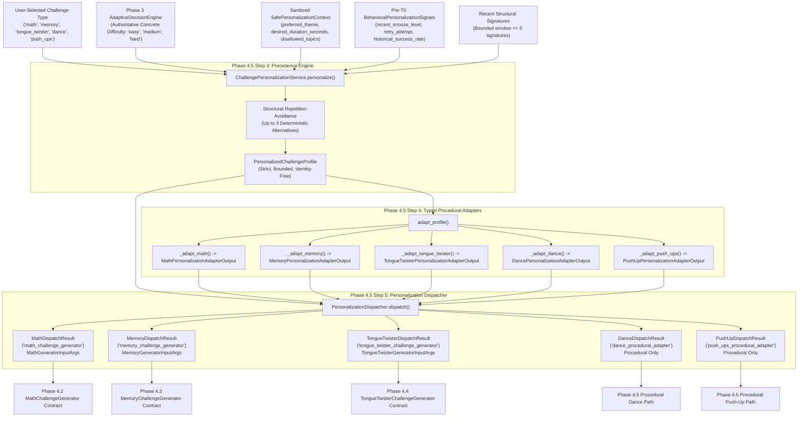

# Phase 4.5: Challenge Personalization Architecture & Specification

**SmartWake AI** — Personalized Adaptive Smart Alarm Clock  
**Package:** `backend.app.services.genai` & `backend.app.schemas`  
**Status:** Completed & Formally Audited (Phase 4.5 Steps 1–7)

---

## 1. Overview & Separation of Concerns

Phase 4.5 establishes the **AI-Powered Challenge Personalization Pipeline** for SmartWake AI. Its primary purpose is personalizing challenge content parameters (e.g., thematic context, arithmetic operation styling, non-numeric memory recall mode, orthographic sound family focus, and physical tempo pacing) **after Phase 3 has already established the authoritative difficulty level**.

### Distinct Phase Responsibilities

SmartWake AI maintains strict architectural boundaries across the challenge lifecycle:

```
┌────────────────────────────────────────────────────────────────────────┐
│ Phase 3: ML Difficulty Adaptation (AdaptiveDecisionEngine)             │
│ - Authoritative for: "How difficult should the wake challenge be?"     │
│ - Output: Concrete difficulty level ('easy', 'medium', 'hard')         │
│ - Preserves user-selected canonical challenge type                     │
└───────────────────────────────────┬────────────────────────────────────┘
                                    │
                                    ▼
┌────────────────────────────────────────────────────────────────────────┐
│ Phase 4.5: Content Personalization Pipeline (THIS SPECIFICATION)       │
│ - Authoritative for: "What parameters shape the challenge for user?"   │
│ - Inputs: Canonical type, concrete difficulty, sanitized preferences,  │
│           pre-T0 behavioral signals, historical structural signatures │
│ - Pure orchestration & deterministic mapping (Zero LLM, Zero DB)       │
│ - Outputs: Typed generator inputs & procedural adapter outputs         │
└───────────────────────────────────┬────────────────────────────────────┘
                                    │
                                    ▼
┌────────────────────────────────────────────────────────────────────────┐
│ Phase 4.2 / 4.3 / 4.4: GenAI Challenge Generators                     │
│ - Authoritative for: "Generate fresh validated structured questions"  │
│ - Coordinates provider prompt, schema validation, answer calculation  │
│ - MathChallengeGenerator, MemoryChallengeGenerator, TongueTwisterGen   │
└───────────────────────────────────┬────────────────────────────────────┘
                                    │
                                    ▼
┌────────────────────────────────────────────────────────────────────────┐
│ Phase 4.7 (Deferred): Runtime Alarm Session Execution & Integration   │
│ - Authoritative for: Invoking generators during live ringing sessions  │
│ - Connects scheduler, wake session state machine, and challenge engine │
└────────────────────────────────────────────────────────────────────────┘
```

---

## 2. Complete Architecture Flow

The end-to-end personalization pipeline flows in a single deterministic direction:



---

## 3. Component Responsibilities

| Component | Primary Responsibility | Inputs | Outputs | Absolute Prohibitions |
| :--- | :--- | :--- | :--- | :--- |
| **`personalization_content_schemas.py`** | Strictly typed domain models for personalization | Field values validated via Pydantic | `PersonalizedChallengeProfile`, typed parameter models | No database IDs, no PII, no ORM types, no `Dict[str, Any]` |
| **`structural_repetition.py`** | Deterministic structural signature calculation & duplicate detection | Candidate profile/inputs, historical signature list | Formatted signature string (`type:diff:...`), boolean repeat flag | No embeddings, no vector DB, no external NLP/LLMs, no randomness |
| **`challenge_personalization_service.py`** | Authoritative precedence resolution & parameter styling | Canonical type, concrete difficulty, safe context, behavioral signals, signatures | `PersonalizedChallengeProfile` | Cannot change difficulty, cannot change challenge type, cannot call DB/LLM |
| **`personalization_adapters.py`** | Deterministic translation into generator-compatible parameter models | `PersonalizedChallengeProfile` | Concrete `PersonalizationAdapterOutput` models | Cannot generate challenge content, cannot modify type/difficulty |
| **`personalization_dispatcher.py`** | Orchestration & routing to target generator/adapter contracts | `PersonalizedChallengeProfile` | Concrete `PersonalizationDispatchResult` union | Cannot generate content, cannot verify challenges, cannot call LLM/DB |

---

## 4. Authoritative Precedence Hierarchy

Phase 4.5 strictly adheres to the established 7-level authority precedence hierarchy:

```
Level 1: SAFETY
         ├─ Forbid forbidden challenge types (number_guessing, numeric_memory)
         ├─ Validate concrete difficulty tier ('easy', 'medium', 'hard')
         ├─ Filter disallowed_topics against topic-like fields (case-insensitive token/substring)
         └─ Exclude all database identity and PII
Level 2: CHALLENGE TYPE
         └─ Authoritative caller/user input; strictly immutable
Level 3: DIFFICULTY
         └─ Authoritative Phase 3 ML decision; strictly immutable
Level 4: EXPLICIT USER PREFERENCES
         └─ preferred_theme, desired_duration_seconds, language (SafePersonalizationContext)
Level 5: BEHAVIORAL SIGNALS
         ├─ recent_snooze_level, is_retry_attempt, historical_success_rate, recent_failure_count
         └─ Tunes generation style within difficulty tier; NEVER alters difficulty
Level 6: REPETITION AVOIDANCE
         ├─ Deterministic candidate signature matching against recent window (<= 5)
         ├─ Up to 3 bounded deterministic alternatives
         └─ Safe fallback preserving type and difficulty if all alternatives repeat
Level 7: SAFE DEFAULTS
         └─ Canonical typed parameter defaults when signals/preferences are absent
```

### Critical Invariant: Duration as Styling Hint Only
`desired_duration_seconds` (bounded between 5 and 300 seconds) is strictly a generation styling hint:
- For math: influences target question count within tier bounds (min vs. max).
- For memory: influences sequence length within tier bounds.
- For tongue twisters: informs passage pacing.
- **It MUST NEVER upgrade, downgrade, or mutate the concrete difficulty tier or alarm time.**

---

## 5. Five Supported Challenge Types

SmartWake AI explicitly routes five canonical wake challenge types:

1. **`math`** (`high cognitive`):
   - Destination: Phase 4.2 [`MathChallengeGenerator`](file:///c:/Users/ADMIN/OneDrive/Documents/Wakeup%20AI/backend/app/services/genai/math_challenge_generator.py).
   - Dispatch target: `"math_challenge_generator"`.
   - Generates arithmetic problems with independently calculated, deterministic Python answers.
2. **`memory`** (`high cognitive`):
   - Destination: Phase 4.3 [`MemoryChallengeGenerator`](file:///c:/Users/ADMIN/OneDrive/Documents/Wakeup%20AI/backend/app/services/genai/memory_challenge_generator.py).
   - Dispatch target: `"memory_challenge_generator"`.
   - **CRITICAL:** Strictly non-numeric visual/spatial recall. Number guessing or numeric memory is strictly forbidden.
3. **`tongue_twister`** (`physical / speech`):
   - Destination: Phase 4.4 [`TongueTwisterChallengeGenerator`](file:///c:/Users/ADMIN/OneDrive/Documents/Wakeup%20AI/backend/app/services/genai/tongue_twister_challenge_generator.py).
   - Dispatch target: `"tongue_twister_challenge_generator"`.
   - Generates phonetically calibrated, alliterative waking passages with deterministic repetition counts.
4. **`dance`** (`physical / movement`):
   - Destination: Phase 4.5 procedural dance adapter path.
   - Dispatch target: `"dance_procedural_adapter"`.
   - **Procedural only.** Carries movement style and pacing parameters. No AI content generation.
5. **`push_ups`** (`physical / exercise`):
   - Destination: Phase 4.5 procedural push-up adapter path.
   - Dispatch target: `"push_ups_procedural_adapter"`.
   - **Procedural only.** Carries cadence tempo and rep styling hints. No AI content generation.

---

## 6. Typed Personalization Parameters

Every canonical challenge type has a strictly bounded, non-arbitrary parameter schema (`extra="forbid", strict=True`):

### 6.1 Math (`MathPersonalizationParams` / `MathPersonalizationAdapterOutput`)
- `focus_topic`: Optional thematic framing (`max_length=30`, validated by `SAFE_TOPIC_REGEX`, e.g., `'astronomy'`, `'budgeting'`, `'morning_routine'`).
- `preferred_operation`: `Optional[Literal["addition", "subtraction", "multiplication", "division", "mixed"]]`.
- `operand_scale_preference`: `Optional[Literal["standard", "compact"]]`.
- `desired_duration_seconds`: `Optional[int]` (5 to 300 seconds).

### 6.2 Memory (`MemoryPersonalizationParams` / `MemoryPersonalizationAdapterOutput`)
- `preferred_mode`: `Optional[Literal["visual_sequence", "spatial_pattern_recall", "dynamic_spatial_path", "symbol_chronological_order"]]`.
- `palette_theme`: `Optional[Literal["colors", "geometric_shapes", "cardinal_directions", "emojis"]]`.
- `desired_duration_seconds`: `Optional[int]` (5 to 300 seconds).

### 6.3 Tongue Twister (`TongueTwisterPersonalizationParams` / `TongueTwisterPersonalizationAdapterOutput`)
- `target_sound_family`: `Optional[Literal["sibilants", "plosives", "liquids", "nasals", "any"]]`.
- `theme_style`: `Optional[Literal["nature", "animals", "workday", "whimsical", "rhyme"]]`.
- `desired_duration_seconds`: `Optional[int]` (5 to 300 seconds).

### 6.4 Dance (`DancePersonalizationParams` / `DancePersonalizationAdapterOutput`)
- `movement_style`: `Optional[Literal["rhythm_groove", "arm_raises", "step_touch", "standard"]]`.
- `pacing`: `Optional[Literal["slow", "moderate", "dynamic"]]`.
- `desired_duration_seconds`: `Optional[int]` (5 to 300 seconds).

### 6.5 Push-Ups (`PushUpPersonalizationParams` / `PushUpPersonalizationAdapterOutput`)
- `cadence_tempo`: `Optional[Literal["steady", "tempo_pause", "standard"]]`.
- `target_rep_styling`: `Optional[Literal["tier_min", "tier_median", "tier_max"]]`.
- `desired_duration_seconds`: `Optional[int]` (5 to 300 seconds).

---

## 7. Structural Repetition Avoidance

Structural repetition avoidance prevents the user from receiving identical challenge structures on consecutive mornings without using heavy vector databases or external embeddings:

1. **Deterministic Structural Signatures:**
   - Format: `<challenge_type>:<difficulty>:<param1>:<param2>` (e.g., `math:easy:addition:compact`, `memory:hard:visual_sequence:colors`).
   - Length is bounded to `<= 60 characters`.
   - Validated against identity-key injection and control characters.
2. **Recent Signature Window:**
   - Maximum capacity is bounded to **5 signatures**.
   - Ordered **newest-first**.
   - When a signature repeats, an LRU promotion mechanism moves it to the front without unbounded growth.
3. **Repetition Alternative Ladder:**
   - Evaluates candidate signature against recent history.
   - Executes up to **3 deterministic alternative attempts** by rotating lower-priority styling parameters (e.g., palette theme, sound family, scale).
   - If all 3 deterministic alternatives are exhausted, safe fallback preserves the original valid candidate while **leaving challenge type and difficulty 100% intact**.
4. **No Embeddings / Vector Databases:**
   - Pure in-memory string and token matching.
   - Zero cosine similarity calls, zero external vector storage, zero network latency.

---

## 8. Privacy & Data Boundary Isolation

The Phase 4.5 personalization layer operates under strict zero-identity guarantees:

- **Zero Database IDs:** `user_id`, `alarm_id`, `session_id` are strictly forbidden.
- **Zero PII:** Names, email addresses, phone numbers, location data, and credentials cannot be passed into any model.
- **Zero Database Connections:** No SQLAlchemy `Session`, ORM models, or connection pools are imported or accessed.
- **Temporal Boundary (Pre-T0):** All behavioral metrics (`recent_snooze_level`, `is_retry_attempt`, `historical_success_rate`, `recent_failure_count`) represent events that occurred **strictly prior to the current alarm ringing time (T < T0)**.
- Zero post-challenge outcomes or active verification grading data are consumed.

---

## 9. Determinism

Phase 4.5 is a **purely deterministic mathematical and algorithmic pipeline**:

- Given identical inputs (`challenge_type`, `difficulty_level`, `safe_context`, `behavioral_signals`, `signatures`), the pipeline is mathematically guaranteed to output identical profiles, adapter models, and dispatch results.
- **Zero Randomness:** No `random`, `uuid`, or `secrets` modules.
- **Zero Timestamps:** No `datetime.now()` or `time.time()`.
- **Zero External State:** Operates completely independently of network status, third-party provider quotas, or LLM availability.

---

## 10. Dispatcher Architecture & Contracts

The [`PersonalizationDispatcher`](file:///c:/Users/ADMIN/OneDrive/Documents/Wakeup%20AI/backend/app/services/personalization_dispatcher.py) coordinates the boundary between profiles and concrete generators:

```
PersonalizedChallengeProfile
           ↓
PersonalizationDispatcher.dispatch()
           ├─ MathDispatchResult         ──> (selected_path="math_challenge_generator", MathGeneratorInputArgs)
           ├─ MemoryDispatchResult       ──> (selected_path="memory_challenge_generator", MemoryGeneratorInputArgs)
           ├─ TongueTwisterDispatchResult──> (selected_path="tongue_twister_challenge_generator", TongueTwisterGeneratorInputArgs)
           ├─ DanceDispatchResult        ──> (selected_path="dance_procedural_adapter", DancePersonalizationAdapterOutput)
           └─ PushUpDispatchResult       ──> (selected_path="push_ups_procedural_adapter", PushUpPersonalizationAdapterOutput)
```

### Dispatcher Responsibilities Matrix
| Responsibility | Status | Details |
| :--- | :--- | :--- |
| **Validate Type & Difficulty Immutability** | **YES** | Rejects non-canonical types and invalid difficulty tiers immediately |
| **Construct Generator Input Contracts** | **YES** | Maps `SafePersonalizationContext` with informed topic/duration styling |
| **Select Downstream Handler Path** | **YES** | Explicit `selected_path` string / enum attribute |
| **Generate Challenge Content** | **NO** | Zero questions, answers, sentence text, routines, or rep counts |
| **Perform Challenge Verification** | **NO** | Zero scoring, pose evaluation, or answer grading |
| **Make Network / LLM Calls** | **NO** | Pure synchronous in-memory execution |
| **Access Database or ORM** | **NO** | Zero database imports or sessions |

---

## 11. Safety & Validation Boundaries

- **Strict Validation:** Every Pydantic model enforces `extra="forbid", strict=True, frozen=True`.
- **Forbidden Challenge Types:** Explicitly rejects sleepy bypass types:
  - `number_guessing`
  - `guess_number`
  - `numeric_memory`
- **Invalid Difficulty Rejection:** Rejects `"adaptive"`, `"extreme"`, `""`, and non-canonical strings with domain exceptions (`DispatcherDifficultyError`).
- **Fail-Closed Architecture:** Any schema mismatch or forbidden token immediately raises an explicit domain exception without falling back to arbitrary untyped defaults.

---

## 12. Testing & Verification Summary

The Phase 4.5 architecture was comprehensively verified across 6 test suites with zero defects:

### Test Suite Execution Summary
1. **Schemas (`test_personalization_content_schemas.py`):** 21 tests passed.
2. **Repetition Engine (`test_structural_repetition.py`):** 60 tests passed.
3. **Personalization Service (`test_challenge_personalization_service.py`):** 46 tests passed.
4. **Procedural Adapters (`test_personalization_adapters.py`):** 82 tests passed.
5. **Dispatcher (`test_personalization_dispatcher.py`):** 44 tests passed.
6. **Pipeline Integration (`test_personalization_pipeline.py`):** 33 tests passed.

**Total Phase 4.5 Tests:** **286 tests passed** (0.507s).  
**Full Backend Suite:** **913 tests passed** (9.900s, zero regressions).  
**Pyright Static Type Checking:** **0 errors, 0 warnings, 0 informations**.

---

## 13. Deferred Work & Non-Goals

Phase 4.5 explicitly scopes out the following capabilities for subsequent phases:

- **Live Runtime GenAI Provider Invocation:** Deferred to Phase 4.7.
- **Alarm Ringing State Machine Integration:** Deferred to Phase 4.7.
- **LLM-Generated Movement Routines:** Dance and push-ups remain strictly procedural.
- **Audio Speech-to-Text Verification:** Handled by Phase 2 / future verification modules.
- **Computer Vision Pose Detection:** Handled by Phase 2 / future movement verification engines.

---

## 14. Architecture Gate Checklist

Formal verification checklist confirming all architectural requirements:

- [x] **No database dependency:** Zero SQLAlchemy, Alembic, or DB service imports.
- [x] **No ORM dependency:** Zero ORM models or database entities consumed.
- [x] **No network dependency:** Zero HTTP requests, sockets, or external network calls.
- [x] **No LLM dependency:** Zero provider calls (`GenAIService`, Gemini, OpenAI).
- [x] **No random dependency:** Zero usage of `random`, `uuid`, or non-deterministic generators.
- [x] **No runtime timestamp dependency:** Zero calls to `datetime.now()` or `time.time()`.
- [x] **No challenge verification:** Verification remains exclusively downstream.
- [x] **No runtime execution:** Execution orchestration remains deferred to Phase 4.7.
- [x] **No Phase 3 modifications:** Phase 3 ML engines and classifiers untouched.
- [x] **No Phase 4.2/4.3/4.4 generator modifications:** Existing generators remain unchanged.
- [x] **Difficulty authority preserved:** Phase 3 concrete tier is strictly immutable.
- [x] **Challenge type authority preserved:** User-selected canonical type is strictly immutable.
- [x] **Typed routing for all five challenge types:** Explicit typed dispatch results.
- [x] **Deterministic repetition handling:** Bounded signature window with deterministic alternatives.
- [x] **Privacy boundary preserved:** Zero user IDs or PII consumed.
- [x] **Existing tests passing:** Full backend suite passing (913 tests, 0 failures).
