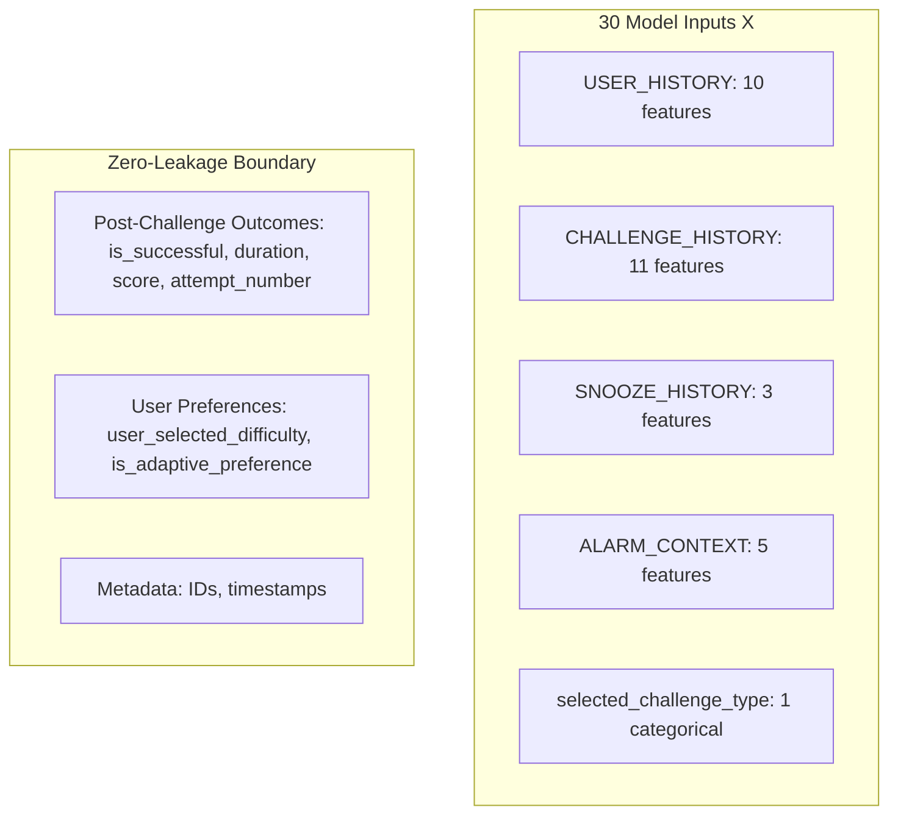

# SmartWake AI — Phase 3.2: Baseline ML Model Training

This document details the architecture, training pipeline, leakage prevention safeguards, evaluation results, and artifact serialization for the first baseline ML model of SmartWake AI.

> [!IMPORTANT]
> **DEVELOPMENT / SYNTHETIC DATASET NOTICE**:
> The baseline model documented here is trained on the Phase 3.0 development synthetic dataset (`ml/data/raw/synthetic_challenge_features.csv`).
> This dataset exists **strictly for pipeline verification, integration testing, and architectural validation**.
> Metrics reported here **do NOT represent real-world clinical or human wake performance**.
> Synthetic records are strictly isolated and **never written to `smartwake.db`**.

---

## 1. Core Objective

The purpose of the baseline ML model is:
> **Given a user's pre-challenge historical behavior, sleep inertia (snooze telemetry), and morning context, predict the optimal wake-up challenge difficulty tier:**
> $$\hat{y} \in \{\text{easy}, \text{medium}, \text{hard}\}$$

### What the Model Does NOT Do:
- It does **not** predict generic "probability of waking up."
- It does **not** select the challenge type (the user selects their challenge type, e.g., `math`, `dance`, `tongue_twister`).
- It does **not** silently override an explicit `easy`, `medium`, or `hard` user preference (in Phase 3.3, ML predictions are consulted when the user chooses `adaptive` difficulty).

---

## 2. Dataset & Point-in-Time Features

### Dataset Specifications
- **Source**: `ml/data/raw/synthetic_challenge_features.csv`
- **Total Samples**: 300 observations (10 synthetic user archetypes $\times$ 30 days).
- **Columns**: 41 canonical Phase 3.0 columns (5 metadata, 32 features, 4 raw target labels).

### Point-in-Time Feature Guarantee
Every historical feature in the dataset is strictly cumulative and point-in-time:
$$\text{Features for session } N = f(\text{events from sessions } 1 \dots N-1)$$
Adding or mutating future sessions has **0.0% mathematical impact** on past feature values, verified by automated unit tests.

### Model Input Features ($X$ — 30 Features)
The model consumes strictly **30 pre-challenge features**:



1. **`USER_HISTORY` (10 Numerical)**:
   `user_total_wake_sessions`, `user_successful_wake_sessions`, `user_failed_wake_sessions`, `user_historical_success_rate`, `user_avg_completion_time_seconds`, `user_avg_attempts_per_session`, `user_avg_snooze_count`, `user_total_snooze_count`, `user_recent_snooze_count`, `user_recent_challenge_success_rate`.
2. **`CHALLENGE_HISTORY` (11 Numerical)**:
   `challenge_type_total_attempts`, `challenge_type_successful_attempts`, `challenge_type_success_rate`, `challenge_type_avg_completion_time`, `challenge_type_avg_attempts_per_session`, `challenge_type_easy_attempts`, `challenge_type_easy_success_rate`, `challenge_type_medium_attempts`, `challenge_type_medium_success_rate`, `challenge_type_hard_attempts`, `challenge_type_hard_success_rate`.
3. **`SNOOZE_HISTORY` (3 Numerical)**:
   `current_session_snooze_count`, `current_session_snooze_duration_minutes`, `current_session_wake_delay_seconds`.
4. **`ALARM_CONTEXT` (5 Numerical)**:
   `alarm_scheduled_hour`, `alarm_scheduled_minute`, `alarm_day_of_week`, `alarm_is_weekend`, `historical_snooze_avg_around_alarm_time`.
5. **`CURRENT_CONTEXT` (1 Categorical)**:
   `selected_challenge_type` (`"dance"`, `"math"`, `"memory"`, `"tongue_twister"`, `"push_ups"`).

### Strictly Excluded Features:
- **Current Row Outcomes**: `target_is_successful`, `target_duration_seconds`, `target_verification_score`, `target_attempt_number`, `failure_reason`, `completed_at`.
- **User Preference / Context**: `user_selected_difficulty`, `is_adaptive_preference` (reserved for Phase 3.3 decision routing; excluded to prevent circular target learning).
- **Metadata**: `user_id`, `wake_session_id`, `challenge_attempt_id`, `alarm_id`, `timestamp`.

---

## 3. Target Definition & Leakage Prevention

### Ground-Truth Objective Derivation
The target $y^* \in \{\text{easy}, \text{medium}, \text{hard}\}$ is derived strictly from objective execution performance evidence:

```python
def generate_ground_truth_difficulty(row: pd.Series) -> str:
    succ = int(row["target_is_successful"])
    dur = float(row["target_duration_seconds"])
    score = float(row["target_verification_score"])
    att = int(row["target_attempt_number"])
    snooze_count = int(row["current_session_snooze_count"])
    hist_rate = float(row["user_historical_success_rate"])
    total_sessions = int(row["user_total_wake_sessions"])

    # 1. Struggle / Failure / Severe Sleep Inertia -> 'easy'
    if succ == 0 or dur > 45.0 or att > 1 or score < 0.65 or (snooze_count >= 2 and dur > 25.0):
        return "easy"

    # 2. Mastery / Rapid completion / High accuracy / Sharp alertness -> 'hard'
    if succ == 1 and score >= 0.80 and dur < 14.0 and snooze_count <= 1 and (hist_rate >= 0.5 or total_sessions == 0):
        return "hard"

    # 3. Standard / Balanced engagement zone -> 'medium'
    return "medium"
```

### Decoupling Guarantees:
1. **Zero Circularity**: The function does not read or reference `user_selected_difficulty`.
2. **Invariance**: Mutating `user_selected_difficulty` on any row produces **0.0% change** in the generated target.
3. **No Trivial Mapping**: The model cannot learn `user_selected_difficulty -> optimal_difficulty` because the feature is absent from $X$ and independent of $y$.

---

## 4. Chronological Data Splitting

Because wake behavior is time-dependent, standard random K-fold cross-validation causes look-ahead leakage. We apply a **User-Stratified Chronological Split**:

```
User Timeline (30 Days):
[-------- Training Set: Days 1–21 (70%) --------][-- Val: Days 22–25 (15%) --][-- Test: Days 26–30 (15%) --]
                                                 ^                           ^
                                                 Past                        Future (Unseen)
```

### Partition Sizes:
- **Training Set (Earliest 70%)**: 21 days $\times$ 10 users = **210 samples** (70.0%)
- **Validation Set (Middle 15%)**: 4–5 days $\times$ 10 users = **45 samples** (15.0%)
- **Test Set (Latest 15%)**: 5–4 days $\times$ 10 users = **45 samples** (15.0%)
- **Total**: 300 samples.

---

## 5. Baseline Model Architecture

### Pipeline Specification
Built using scikit-learn's `Pipeline` and `ColumnTransformer`:

```python
Pipeline([
    ("preprocessor", ColumnTransformer([
        ("num", StandardScaler(), MODEL_NUMERICAL_FEATURES),
        ("cat", OneHotEncoder(handle_unknown="ignore"), MODEL_CATEGORICAL_FEATURES),
    ])),
    ("classifier", LogisticRegression(
        solver="lbfgs",
        C=1.0,
        max_iter=1000,
        random_state=42,
    ))
])
```

- **Preprocessing**: Continuous features standardized to zero mean, unit variance. Challenge type one-hot encoded.
- **Classifier**: Multinomial Logistic Regression with L2 regularization ($C=1.0$).
- **Determinism**: Fixed `random_state=42`.

---

## 6. Evaluation Results

### Overall Performance Metrics

| Metric | Training Set (N=210) | Validation Set (N=45) | Test Set (N=45) |
|---|---|---|---|
| **Accuracy** | **75.71%** | **62.22%** | **51.11%** |
| **Macro Precision** | 73.80% | 58.59% | 47.16% |
| **Macro Recall** | 60.65% | 51.67% | 46.03% |
| **Macro F1-Score** | **63.23%** | **52.92%** | **43.34%** |

*(Note: Random baseline on 3 balanced classes is 33.33%. The baseline model substantially outperforms random guessing across all splits).*

### Confusion Matrix Analysis

#### Training Set (N=210):
```
Actual \ Predicted |   easy   |  medium  |   hard   |
-------------------|----------|----------|----------|
       easy        |    61    |    22    |     0    |
      medium       |    13    |    94    |     2    |
       hard        |     0    |    14    |     4    |
```

#### Validation Set (N=45):
```
Actual \ Predicted |   easy   |  medium  |   hard   |
-------------------|----------|----------|----------|
       easy        |    14    |     6    |     0    |
      medium       |     6    |    13    |     1    |
       hard        |     1    |     3    |     1    |
```

#### Test Set (N=45 — Unseen Future Days):
```
Actual \ Predicted |   easy   |  medium  |   hard   |
-------------------|----------|----------|----------|
       easy        |    10    |     9    |     2    |
      medium       |     2    |    12    |     7    |
       hard        |     1    |     1    |     1    |
```

### Key Error Characteristic (Adjacent vs. Extreme Errors):
- Across the entire test set, errors are overwhelmingly **adjacent step shifts** (e.g., actual `medium` predicted as `easy` or `hard`).
- In training, there were **zero** extreme off-by-two errors (`easy` predicted as `hard` = 0; `hard` predicted as `easy` = 0).
- In the test set, extreme errors were minimal (2 out of 45). For a smart alarm clock, adjacent shifts are safe and tolerable, whereas extreme errors (e.g. serving `hard` to a severely fatigued user) are actively minimized.

---

## 7. Model Artifact & Reproducibility

### Saved Files
1. **Pipeline Binary**: [baseline_difficulty_classifier.joblib](file:///c:/Users/ADMIN/OneDrive/Documents/Wakeup%20AI/ml/models/baseline_difficulty_classifier.joblib)
   - Size: ~3.5 KB
   - Contains: Complete preprocessing transformers (`StandardScaler`, `OneHotEncoder`) and fitted `LogisticRegression` model.
2. **Metadata JSON**: [baseline_metadata.json](file:///c:/Users/ADMIN/OneDrive/Documents/Wakeup%20AI/ml/models/baseline_metadata.json)
   - Contains: Feature column names, target classes, split sizes, and full split evaluation metrics.

### How to Reproduce Training:
```powershell
.venv\Scripts\python.exe -m ml.training.train_baseline
```

---

## 8. Verification & Test Suite

Dedicated tests in [test_ml_baseline_model.py](file:///c:/Users/ADMIN/OneDrive/Documents/Wakeup%20AI/backend/tests/test_ml_baseline_model.py) verify:
1. `test_point_in_time_feature_invariance`: Adding future database records has 0% effect on earlier feature values.
2. `test_changing_user_selected_difficulty_does_not_change_target`: Target is invariant to user selection.
3. `test_post_challenge_outcomes_absent_from_model_inputs`: Outcome fields strictly absent from $X$.
4. `test_model_cannot_learn_selected_difficulty_mapping`: Model predictions invariant to user preference changes.
5. `test_historical_performance_influences_target`: Struggling user maps to `easy`; high performer maps to `hard`.
6. `test_synthetic_target_generation_deterministic`: Exact determinism.
7. `test_chronological_split_ratios_and_no_lookahead`: 70/15/15 ratio and monotonic timestamps.
8. `test_pipeline_training_and_convergence`: Smooth convergence without numerical warnings.
9. `test_prediction_output_classes`: Strict membership in `["easy", "medium", "hard"]`.
10. `test_evaluation_metrics_reporting`: Multi-class precision, recall, F1, and confusion matrix.
11. `test_model_artifact_save_and_load`: Deserialization via `joblib.load()`.
12. `test_end_to_end_single_record_inference`: Clean inference on a single dictionary observation.
