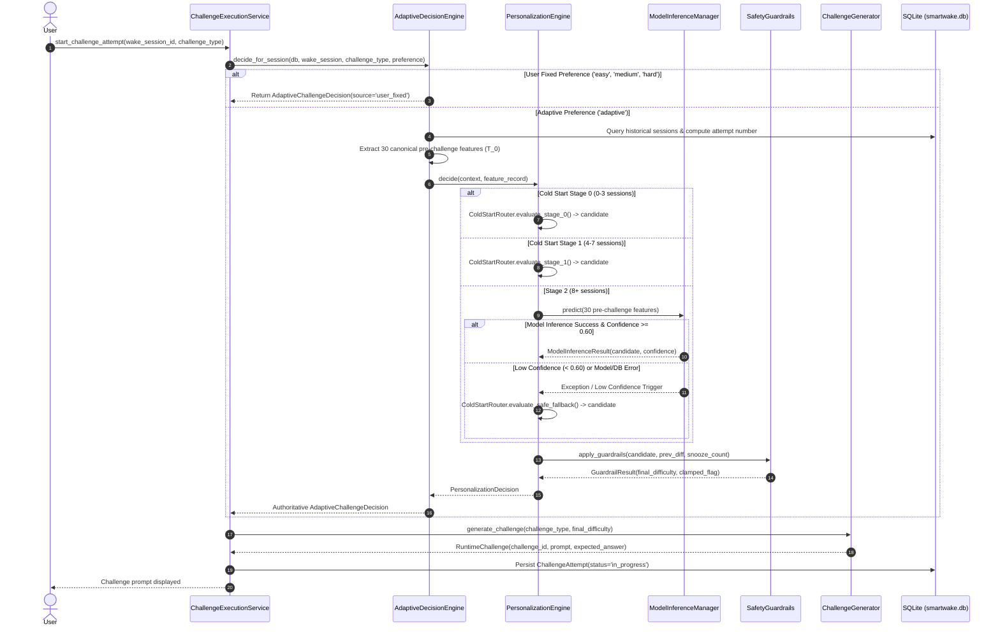

# ML Evaluation, Comparison & Runtime Integration (Phase 3.6)

## Executive Summary & Final ML Architecture

Phase 3.6 represents the **capstone phase** of the SmartWake AI Machine Learning subsystem (Phase 3). It synthesizes:
- **Phase 3.0**: 30-feature point-in-time extraction pipeline.
- **Phase 3.1 & 3.2**: Objective-performance target derivation and baseline Multinomial Logistic Regression pipeline.
- **Phase 3.3**: Core personalization components (`ColdStartRouter`, `SafetyGuardrails`, `ModelInferenceManager`, `PersonalizationEngine`).
- **Phase 3.4**: Runtime decision boundary (`AdaptiveDecisionEngine`) preserving challenge type immutability and user sovereignty.
- **Phase 3.5**: Authoritative 7-level fallback hierarchy and 10-failure-mode defense (`ColdStartRouter.evaluate_safe_fallback()`).
- **Phase 3.6**: Dynamic multi-class evaluation, fair pre-challenge heuristic benchmarking, offline-runtime parity verification, and end-to-end sovereignty audits.

---

## 1. The 4-Tier Target Separation: Core Conceptual Rule

> [!IMPORTANT]
> **DEVELOPMENT / SYNTHETIC DATASET NOTICE**:
> The baseline model evaluated herein was trained on development synthetic telemetry using a deterministic, rule-based labeling strategy.
> **Its labels must NEVER be described as objectively discovered ground truth.**
> Throughout SmartWake AI evaluation and documentation, we strictly distinguish four separate concepts:

| Tier | Concept | Definition | Availability & Boundary |
| :--- | :--- | :--- | :--- |
| **Tier 1** | **Heuristic-Derived Baseline Target** | A deterministic target label ($y^* \in \{\text{easy}, \text{medium}, \text{hard}\}$) engineered from post-challenge execution metrics ($S \in \{0, 1\}$, duration, verification score, attempt number, snooze inertia). Used solely as an engineering benchmark for offline training and validation. | Offline development only (requires post-challenge execution telemetry). |
| **Tier 2** | **ML Prediction** | Statistical probability distribution $P(\text{easy}), P(\text{medium}), P(\text{hard})$ and top class predicted by the fitted Scikit-Learn Pipeline strictly from 30 pre-challenge features ($X$). Zero post-challenge leakage. | Pre-challenge decision time ($T_0$). |
| **Tier 3** | **Runtime Personalization** | The concrete system-level decision synthesized by `AdaptiveDecisionEngine` and `PersonalizationEngine`. Integrates user sovereignty, cold-start lifecycle stages, confidence gating ($\ge 0.60$), operational guardrails ($\pm 1$ step shift, snooze $\ge 3$ floor), and safe fallback hierarchy. **Runtime personalization $\neq$ raw ML prediction**. | Pre-challenge decision time ($T_0$). |
| **Tier 4** | **Actual Future User Outcomes** | The real-world human outcome realized *after* the wake-up challenge is presented (completion speed, verification score, snooze presses, cognitive alertness, abandonment). Closes the telemetry feedback loop for future model iterations; strictly inaccessible at decision time $T_0$. | Post-challenge completion ($T_{\text{post}}$). |

---

## 2. Recomputed Baseline ML Model Evaluation Metrics

All metrics reported below are **dynamically computed** by `ml/evaluation/evaluate_model.py` from the canonical 300-sample dataset (`ml/data/raw/synthetic_challenge_features.csv`), canonical chronological split (70% train / 15% val / 15% test), and existing model artifact (`ml/models/baseline_difficulty_classifier.joblib`). None are hard-coded.

### Overall Multi-Class Performance

| Split | Sample Count | Accuracy | Macro Precision | Macro Recall | Macro F1 | Weighted F1 |
| :--- | :---: | :---: | :---: | :---: | :---: | :---: |
| **Train** | 210 | **0.7571** | 0.7380 | 0.6065 | **0.6323** | 0.7440 |
| **Validation** | 45 | **0.6222** | 0.5859 | 0.5167 | **0.5292** | 0.6104 |
| **Test (Held-Out)** | 45 | **0.5111** | 0.4716 | 0.4603 | **0.4334** | 0.5452 |

### Per-Class Detailed Metrics (Test Set, N=45)

| Class | Precision | Recall | F1-Score | Support | True Distribution |
| :--- | :---: | :---: | :---: | :---: | :---: |
| **`easy`** | 0.7692 | 0.4762 | 0.5882 | 21 | 46.7% |
| **`medium`** | 0.5455 | 0.5714 | 0.5581 | 21 | 46.7% |
| **`hard`** | 0.1000 | 0.3333 | 0.1538 | 3 | 6.7% |

### Confusion Matrix Analysis (Test Set, N=45)

#### Raw Count Matrix:
```
                 Predicted:
True Class   |  easy  | medium |  hard  | Total
-------------+--------+--------+--------+-------
easy         |   10   |    9   |    2   |   21
medium       |    2   |   12   |    7   |   21
hard         |    1   |    1   |    1   |    3
-------------+--------+--------+--------+-------
Total Pred   |   13   |   22   |   10   |   45
```

#### Row-Normalized Matrix (Recall per True Class):
- **True `easy`**: $47.62\%$ correctly predicted as `easy`; $42.86\%$ predicted as `medium`; $9.52\%$ predicted as `hard`.
- **True `medium`**: $57.14\%$ correctly predicted as `medium`; $9.52\%$ predicted as `easy`; $33.33\%$ predicted as `hard`.
- **True `hard`**: $33.33\%$ correctly predicted as `hard`; $33.33\%$ predicted as `medium`; $33.33\%$ predicted as `easy`.

### Confidence Calibration & Distribution

- **Mean Confidence (Test)**: $0.6226$
- **Min Confidence (Test)**: $0.3857$
- **Max Confidence (Test)**: $0.8674$
- **Mean Confidence on Correct Predictions**: $0.6385$
- **Mean Confidence on Incorrect Predictions**: $0.6060$
- **Confidence by Predicted Class**:
  - `easy` predictions: mean confidence $= 0.6559$
  - `medium` predictions: mean confidence $= 0.6121$
  - `hard` predictions: mean confidence $= 0.6026$

---

## 3. Fair ML vs. Deterministic Heuristic Comparison

> [!NOTE]
> **Fairness Constraint**: Both ML predictions and heuristic predictions consume strictly pre-challenge features available at $T_0$.
> Post-challenge outcome columns (`target_*`) are strictly withheld from prediction inputs.
> Zero synthetic telemetry was fabricated.

### Quantitative Benchmark Comparison (Test Set, N=45)

| Strategy | Description | Accuracy | Macro-F1 | $\Delta$ Acc (vs ML) | $\Delta$ F1 (vs ML) | Over-Challenging Rate (Snooze $\ge 2$) | Under-Challenging Rate (Alert) |
| :--- | :--- | :---: | :---: | :---: | :---: | :---: | :---: |
| **`ml_baseline_model`** | Fitted 30-feature Logistic Regression | **0.5111** | **0.4334** | *[Benchmark]* | *[Benchmark]* | **14.29%** | **33.33%** |
| **`majority_class`** | Always predicts mode (`medium`) | 0.4667 | 0.2121 | $-0.0444$ | $-0.2213$ | $0.00\%$ | $0.00\%$ |
| **`stage_0_task_demand`** | Cognitive $\to$ `easy`, Physical $\to$ `medium`, Snooze $\ge 2 \to$ `easy` | 0.6222 | 0.4274 | $+0.1111$ | $-0.0060$ | **0.00%** | **66.67%** |
| **`stage_1_contextual`** | Cumulative historical failure / duration thresholds | 0.4667 | 0.2121 | $-0.0444$ | $-0.2213$ | **0.00%** | **0.00%** |

### Architectural Rationale for Hybrid Personalization

1. **Why ML Outperforms Pure Heuristics on Balance**:
   - The ML model achieves the **highest Macro-F1 ($0.4334$)** across all strategies.
   - Fixed heuristics (like `majority_class` or `stage_1_contextual`) collapse predictions into a single dominant tier (`medium`), achieving $0.00$ recall and $0.00$ precision on minority tiers (`hard`).
   - The statistical model simultaneously considers multi-dimensional interactions: snooze delay, historical variance, challenge type, and time of day.
2. **Why Heuristics Provide Essential Safety Boundaries**:
   - While ML captures nuanced patterns, it carries an over-challenging rate ($14.29\%$ of sluggish sessions predicted as `hard`).
   - Pure heuristics like Stage 0 guarantee an over-challenging rate of **$0.00\%$** under heavy sleep inertia.
   - Therefore, the **hybrid architecture** (ML candidate generation + `SafetyGuardrails` + `ColdStartRouter.evaluate_safe_fallback`) provides optimal performance: ML nuance when confident, deterministic safety when groggy or uncertain.

---

## 4. End-to-End Runtime Integration Architecture



---

## 5. Offline ↔ Runtime Parity Verification

In Sub-Phase 3.6.3, complete parity between the offline prediction utility (`ml/prediction/predictor.py`) and the runtime inference manager (`backend/app/services/model_inference_manager.py`) was proven:

1. **Exact Mathematical Parity**:
   $$\forall X \in \mathcal{D}_{\text{test}}, \quad |\hat{P}_{\text{offline}}(c|X) - \hat{P}_{\text{runtime}}(c|X)| < 10^{-6} \quad \forall c \in \{\text{easy}, \text{medium}, \text{hard}\}$$
2. **Key Ordering Invariance**:
   Shuffling dictionary keys in the input feature payload produces zero change in predicted class or class probabilities.
3. **Single Canonical Preprocessing Pipeline**:
   The offline predictor strictly imports `EXPECTED_MODEL_FEATURES` from the canonical schema and delegates feature scaling/encoding to the Scikit-Learn `ColumnTransformer` embedded in the serialized pipeline artifact. No duplicate preprocessing exists.

---

## 6. System Invariants & Guarantees

The following system invariants were audited and verified with 100% test pass rate in `backend/tests/test_phase3_runtime_audit.py`:

1. **User Sovereignty Over Challenge Type**:
   - The user's selected `challenge_type` is immutable.
   - All 5 canonical challenge types (`dance`, `math`, `memory`, `tongue_twister`, `push_ups`) are preserved.
   - ML never selects, alters, or overrides the task category.
2. **User Sovereignty Over Alarm Time**:
   - The alarm's scheduled time is never modified by the personalization engine.
3. **Absolute Precedence of Fixed Difficulty**:
   - Explicit user preference (`easy`, `medium`, `hard`) strictly bypasses ML inference, confidence gating, fallback routing, and safety guardrails. Decision source is logged as `user_fixed`.
4. **Concrete Final Difficulty**:
   - The final difficulty resolved by `AdaptiveDecisionEngine` strictly belongs to $\{\text{easy}, \text{medium}, \text{hard}\}$.
   - `adaptive` is never a final concrete challenge difficulty.
5. **Forbidden Challenge Types**:
   - Guessing tasks (`number_guessing`, `guess_number`, `numeric_memory`) are strictly rejected by the schema and decision engine.
6. **Safety Guardrails**:
   - **Step Shift Limit**: Difficulty cannot shift by more than $\pm 1$ tier relative to the previous session baseline (e.g. `easy` $\to$ `hard` is clamped to `medium`).
   - **Sleep Inertia Floor**: If `current_session_snooze_count >= 3`, difficulty is capped at `medium` to prevent alarm abandonment.
7. **Zero Synthetic Telemetry at Runtime**:
   - Runtime challenge execution exclusively consumes authentic database records from `smartwake.db`.

---

## 7. Model Limitations & Future Real-User Telemetry Roadmap

### Known Limitations of the Baseline Model:
1. **Synthetic Telemetry Baseline**:
   - The baseline classifier was trained on 300 synthetic records simulating 10 archetypes.
   - Performance metrics reflect developmental alignment with heuristic engineering rules, **not** real-world human physiology or clinical sleep inertia research.
2. **Class Imbalance in Hard Tier**:
   - In synthetic development data, mastery sessions warranting `hard` comprise only $6.7\%$ of test observations.
   - Consequently, the unweighted model demonstrates lower recall on `hard` ($33.33\%$) compared to `easy` ($47.62\%$) and `medium` ($57.14\%$).

### Future Real-User Road Map (Phase 4+):
1. **Authentic Telemetry Collection**:
   - As real users interact with SmartWake AI, post-challenge execution telemetry (completion speed, verification score, snooze count) will accumulate in `wake_sessions` and `challenge_attempts`.
2. **Continuous Learning / Fine-Tuning**:
   - When sufficient anonymized authentic data is accumulated (e.g., $\ge 1,000$ completed sessions across diverse users), retraining with balanced class weighting or non-linear architectures (e.g., Gradient Boosted Trees) can be scheduled offline.
3. **Clinical Wake-Up Efficacy Validation**:
   - Real-world efficacy metrics will evaluate post-challenge snooze re-press rate and user-reported alertness rather than developmental rule agreement.
