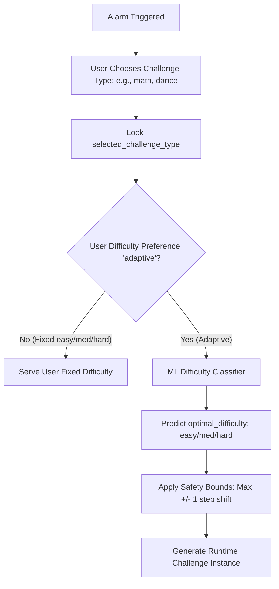
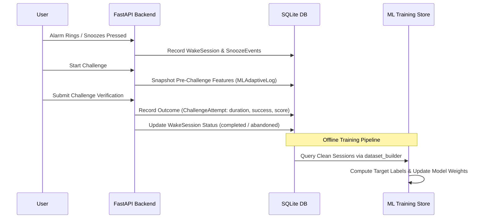

# SmartWake AI — Phase 3.1: ML Target & Training Strategy

This document specifies the official Machine Learning target definition, supervised problem formulation, feature partitioning, training/validation protocol, and evaluation strategy for Phase 3 of SmartWake AI.

---

## 1. Core Objective & Problem Definition

### What SmartWake ML Does
The ML system in SmartWake AI exists to solve an operational decision problem:
> **"Given a specific user, their historical wake behavior, current sleep inertia (snooze telemetry), morning context, and their selected challenge type, which difficulty level (easy, medium, or hard) will maximize cognitive wakefulness and lead to successful alarm dismissal without causing frustration or abandonment?"**

### Product & Operational Boundaries
1. **Selected Challenge Type as Categorical Input**: The user selects their preferred challenge type (e.g., `dance`, `math`, `memory`, `tongue_twister`, `push_ups`). This is fed as a categorical input to the ML model.
2. **ML Predicts Difficulty Only**: The ML model predicts the optimal difficulty level (`easy`, `medium`, `hard`) strictly **within** the user-selected challenge type.
3. **ML Never Changes Challenge Type**: The ML model never substitutes or alters the challenge type chosen by the user.
4. **ML Never Changes Alarm Time**: Alarm schedules and wake times are set strictly by the user; ML never alters alarm trigger times.

### Why NOT "Probability of Waking Up"?
Predicting the raw probability that a user will wake up (e.g. $\hat{P}(\text{wake}) = 0.82$) does **not** solve the alarm clock's problem. An alarm clock is an active intervention system:
1. **Lack of Actionability**: A model that only outputs $\hat{P}(\text{wake})$ cannot tell the scheduler which difficulty tier to serve.
2. **Confounded by Interventions**: If the user wakes up, was it because of the challenge or in spite of it? A binary wake predictor conflates user alertness with challenge efficacy.
3. **Operational Decision Space**: The alarm system must select an action $a$ from a discrete action space $\mathcal{A} = \{\text{easy}, \text{medium}, \text{hard}\}$ (within the user's selected challenge type) to optimize morning wakefulness.

---

## 2. Supervised Learning Formulation

### Evaluated Formulations

| Formulation | Description | Strengths | Weaknesses | Decision |
|---|---|---|---|---|
| **A. Direct Multi-Class Classification** | Predict the discrete optimal difficulty: $\hat{y} \in \{\text{easy}, \text{medium}, \text{hard}\}$. | Clear objective, direct mapping to software configuration, simple interpretability. | Requires an operational ground-truth labeling policy for historical sessions. | **Recommended for Baseline (Phase 3.2)** |
| **B. Expected Effectiveness Scoring (Regression / Ranking)** | For each candidate action $a \in \mathcal{A}$, predict an expected Challenge Effectiveness Score $\widehat{\text{CES}}(u, a, c) \in [0, 1]$, then rank actions: $a^* = \arg\max_a \widehat{\text{CES}}$. | Reflects continuous counterfactual decision-making; handles continuous parameter adaptation. | Requires scoring multiple candidate actions at inference time; slightly more complex evaluation. | **Recommended for Advanced Adaptation (Phase 3.3+)** |
| **C. Binary Success Prediction per Difficulty** | Predict $\hat{P}(\text{success} \mid \text{difficulty})$. | Simple binary classification. | Trivializes problem: "easy" challenges always have highest success probability, leading to degenerative policy of always picking easy. | **Rejected** |

### Selected Formulation for SmartWake AI
We adopt a **two-tier architecture**:
1. **Primary Operational Model (Classification)**:
   A multi-class classifier that predicts the **Optimal Difficulty Tier** $y^* \in \{\text{easy}, \text{medium}, \text{hard}\}$ for the user's chosen challenge type given their pre-challenge state.
2. **Conceptual Utility vs. Operational Labeling**:
   - **CES (Challenge Effectiveness Score)** serves as the overarching **conceptual evaluation framework**.
   - **Deterministic Objective-Performance Labeling** serves as the **operational baseline proxy** in Phase 3.2 to assign discrete ground-truth labels from observed attempt telemetry.
   - The baseline classifier learns to approximate that rule-derived policy using **only pre-challenge features**.

---

## 3. Exact Target & Label Definition

### Conceptual Framework: Challenge Effectiveness Score (CES)
Conceptually, an effective wake-up challenge satisfies three competing requirements:
1. **Feasibility**: The user completes the challenge without abandonment or excessive retries ($S \in \{0, 1\}$, attempt $\le 2$).
2. **Cognitive Activation**: The challenge requires meaningful mental or physical exertion (duration in optimal engagement window $[10\text{s}, 35\text{s}]$; quality score $Q \ge 0.70$).
3. **Session Resolution**: Sleep inertia dissipates cleanly without post-challenge relapse.

The conceptual utility score is formulated as:
$$\text{CES} = w_s \cdot S + w_q \cdot Q + w_d \cdot D_{\text{norm}} - w_f \cdot F$$
Where:
- $S \in \{0, 1\}$: `is_successful` (1 if passed, 0 if failed).
- $Q \in [0, 1]$: `verification_score` (normalized quality/accuracy).
- $D_{\text{norm}} \in [0, 1]$: Normalized duration score peaking in $[10\text{s}, 35\text{s}]$.
- $F$: Frustration penalty (retries $> 2$ or abandoned session).
- Weights: $w_s = 0.40, w_q = 0.30, w_d = 0.30$.

### Operational Baseline Proxy: Deterministic Objective-Performance Labeling (Phase 3.2)
Phase 3.2 does **not** directly compute continuous CES scores to generate training labels. Instead, it employs a deterministic, rule-based objective-performance labeling function as the operational proxy for `optimal_difficulty` ($y^* \in \{\text{easy}, \text{medium}, \text{hard}\}$):

```python
def generate_ground_truth_labels(row: pd.Series) -> str:
    succ = int(row["target_is_successful"])
    dur = float(row["target_duration_seconds"])
    score = float(row["target_verification_score"])
    att = int(row["target_attempt_number"])
    snooze_count = int(row["current_session_snooze_count"])
    hist_rate = float(row["user_historical_success_rate"])
    total_sessions = int(row["user_total_wake_sessions"])

    # 1. Struggle / Failure / Severe Sleep Inertia -> 'easy'
    if succ == 0 or dur > 45.0 or att > 1 or score < 0.65 or (snooze_count >= 2 and dur > 25.0):
        return "easy"

    # 2. Mastery / Rapid completion / High accuracy / Alertness -> 'hard'
    if succ == 1 and score >= 0.80 and dur < 14.0 and snooze_count <= 1 and (hist_rate >= 0.5 or total_sessions == 0):
        return "hard"

    # 3. Standard / Balanced engagement zone -> 'medium'
    return "medium"
```

### Decoupling from User Preferences & Target Leakage Guardrails
1. **No Circularity**: The labeling policy strictly evaluates post-challenge execution telemetry (`is_successful`, `duration_seconds`, `verification_score`, `attempt_number`, `snooze_count`, `historical_success_rate`).
2. **Zero Dependency on `user_selected_difficulty`**: The labeling function does **not** read or copy `user_selected_difficulty`. Mutating `user_selected_difficulty` produces **0.0% variance** in the derived target.
3. **Approximation Objective**: The supervised ML classifier learns to approximate this operational policy using **only pre-challenge features** available at $T_0$.

---

## 4. Input Features vs. Targets vs. Metadata

The ML pipeline strictly separates the 41 dataset columns into three mutually exclusive sets:

```mermaid
graph LR
    subgraph Raw Dataset [41 Columns]
        M[5 Metadata Columns]
        X[30 Model Input Features]
        EX[2 User Preference Context Features]
        Y_raw[4 Raw Telemetry Targets]
    end
    
    X --> ML_Model[Supervised ML Baseline Model]
    Y_raw --> Labeling_Fn[Deterministic Labeling Policy]
    Labeling_Fn --> Y_target[Target: optimal_difficulty y*]
    Y_target --> Loss[Cross-Entropy Loss / Training]
    ML_Model --> Loss
    
    EX -. Excluded from X: Phase 3.3 Routing .-> Routing[Runtime Difficulty Router]
    M -. Excluded from X and Y .-> Split[Chronological Splitter]
```

### 1. Model Input Features ($X$ — 30 Features)
All features represent user state available **strictly before** the challenge is initiated ($T_0$):

- **`USER_HISTORY` (10 numerical features)**:
  `user_total_wake_sessions`, `user_successful_wake_sessions`, `user_failed_wake_sessions`, `user_historical_success_rate`, `user_avg_completion_time_seconds`, `user_avg_attempts_per_session`, `user_avg_snooze_count`, `user_total_snooze_count`, `user_recent_snooze_count`, `user_recent_challenge_success_rate`.
- **`CHALLENGE_HISTORY` (11 numerical features)**:
  `challenge_type_total_attempts`, `challenge_type_successful_attempts`, `challenge_type_success_rate`, `challenge_type_avg_completion_time`, `challenge_type_avg_attempts_per_session`, `challenge_type_easy_attempts`, `challenge_type_easy_success_rate`, `challenge_type_medium_attempts`, `challenge_type_medium_success_rate`, `challenge_type_hard_attempts`, `challenge_type_hard_success_rate`.
- **`SNOOZE_HISTORY` (3 numerical features)**:
  `current_session_snooze_count`, `current_session_snooze_duration_minutes`, `current_session_wake_delay_seconds`.
- **`ALARM_CONTEXT` (5 numerical features)**:
  `alarm_scheduled_hour`, `alarm_scheduled_minute`, `alarm_day_of_week`, `alarm_is_weekend`, `historical_snooze_avg_around_alarm_time`.
- **`CURRENT_CONTEXT` (1 categorical feature)**:
  `selected_challenge_type` (e.g., `"dance"`, `"math"`, `"memory"`, `"tongue_twister"`, `"push_ups"`).

### 2. Strictly Excluded from Model Inputs ($X$)
To prevent target leakage and circular preference loops, the following features are strictly excluded from $X$:
- `user_selected_difficulty`: Excluded from $X$. Used in Phase 3.3 as user configuration context.
- `is_adaptive_preference`: Excluded from $X$. Used in Phase 3.3 as an activation gate.
- Post-challenge outcomes: `target_is_successful`, `target_duration_seconds`, `target_verification_score`, `target_attempt_number` are strictly excluded from $X$.

### 3. Supervised Target ($Y$)
- Operational Target: `optimal_difficulty` ($y^* \in \{\text{easy}, \text{medium}, \text{hard}\}$).

### 4. Metadata ($M$ — Excluded from $X$ and $Y$)
Used strictly for indexing, chronological sorting, and auditing:
- `user_id`, `wake_session_id`, `challenge_attempt_id`, `alarm_id`, `timestamp`.

---

## 5. Temporal & Target Leakage Safeguards

1. **Point-in-Time Feature Engineering**:
   - All historical aggregates (e.g. `user_historical_success_rate`, `challenge_type_avg_completion_time`) are computed using **only information available strictly before** the target challenge occurred ($T_0$).
   - Future sessions and intra-session future events are strictly invisible to feature computation.
2. **Intra-Session Isolation**:
   - If an attempt is a retry (`attempt_number == 2`), prior attempts from the *same session* may only be referenced if completed prior to $T_0$.
3. **Chronological Validation Integrity**:
   - Standard random cross-validation is strictly forbidden.
   - All model validation must use time-ordered chronological splits (e.g., 70% train / 15% validation / 15% test).

---

## 6. Challenge Type & Difficulty Selection Strategy

### Product Hierarchy & Responsibilities
The selection architecture respects the user's authority while enabling ML difficulty adaptation:



### Cardinal Rules:
1. **ML Predicts Difficulty Only**: The ML model predicts difficulty (`easy`, `medium`, `hard`) within the user's chosen challenge type.
2. **ML Never Changes Challenge Type**: Challenge type is determined solely by the user (or alarm configuration).
3. **ML Never Changes Alarm Time**: Wake time is invariant to ML predictions.
4. **Safety Bounding (Operational Guardrails)**:
   - **Maximum Step Shift**: Difficulty adjusts by at most $\pm 1$ level compared to previous successful baseline.
   - **Sleep Inertia Floor**: If `current_session_snooze_count >= 3`, difficulty is capped at `medium` (never `hard`) to prevent morning frustration.

---

## 7. Cold-Start Strategy for Zero-History Users

When a new user registers, historical metrics are zero. SmartWake AI employs a **Three-Stage Cold-Start Lifecycle**:

```
Stage 0: Pure Heuristic (Sessions 1–3)
  ↓
Stage 1: Contextual Rules + Bayesian Smoothing (Sessions 4–7)
  ↓
Stage 2: Full ML Personalization (Sessions 8+)
```

### Stage 0: Heuristic Fallback (Sessions 1 to 3)
- Use the user's configured baseline preference (`difficulty_preference`).
- If baseline is `adaptive`, default to:
  - `medium` for physical/speech tasks (`dance`, `tongue_twister`, `push_ups`).
  - `easy` for high-cognitive tasks (`math`, `memory`) to prevent early morning cognitive paralysis.
- Snooze mitigation heuristic: If user snoozes $\ge 2$ times, downgrade to `easy`.

### Stage 1: Contextual Rules + Bayesian Prior (Sessions 4 to 7)
- Blend the user's sparse empirical observations with global population priors.
- Adjust difficulty based on rolling 3-day success and completion speed:
  - 3/3 successes with speed $< 12\text{s} \rightarrow$ promote to next difficulty.
  - $\ge 1$ failure or speed $> 45\text{s} \rightarrow$ maintain or demote.

### Stage 2: Active ML Policy (Session 8+)
- Feature vectors are populated with statistically meaningful history.
- The ML classifier makes predictions with a confidence threshold:
  - If model confidence $\ge 0.60 \rightarrow$ apply model recommendation.
  - If model confidence $< 0.60 \rightarrow$ fall back to Stage 1 contextual heuristic.

---

## 8. Synthetic Data Strategy & Role Separation

SmartWake AI generated a synthetic dataset in Phase 3.0 (`ml/data/raw/synthetic_challenge_attempts.json`, 300 records across 10 user archetypes).

### Strict Boundary Rules for Synthetic Data:
1. **Pipeline & Integration Testing ONLY**:
   - Synthetic data is used exclusively to verify that dataset loaders, feature extractors, training scripts, and preprocessing pipelines execute end-to-end without crashing.
2. **Never Validated as Real-World Evidence**:
   - Model performance metrics (accuracy, F1, ROC-AUC) computed on synthetic data must **never** be cited as evidence of real-world efficacy. Synthetic distributions reflect generator assumptions, not genuine human sleep biology.
3. **Absolute Isolation from Production**:
   - Synthetic records are **strictly forbidden** from being committed, seeded, or inserted into `smartwake.db`.

---

## 9. Future Real-Data Collection Strategy

When SmartWake AI is used in production, telemetry is collected passively and securely:



### Data Integrity & User Privacy:
- **On-Device / Local Storage**: All telemetry resides in the user's local SQLite database.
- **Explainability Logging**: Every adaptive decision stores a record in `ml_adaptive_logs` linking the input snapshot to the decision rationale.

---

## 10. Data Splitting Strategy (Time-Dependent Data)

Because waking behavior is autocorrelated and non-stationary (habits evolve over time), standard random cross-validation leaks temporal patterns.

### 1. User-Stratified Chronological Train/Val/Test Split
For offline model training and final benchmark evaluation:
- Sort each user's sessions chronologically by `scheduled_time`.
- **Training Set (Earliest 70%)**: Used for feature scaling and model parameter fitting.
- **Validation Set (Middle 15%)**: Used for hyperparameter tuning and early stopping.
- **Test Set (Latest 15%)**: Represents unseen *future* mornings; used strictly for final generalization assessment.

```
User Timeline: [--------- Train (70%) ---------][--- Val (15%) ---][--- Test (15%) ---]
                                                ^                  ^
                                                Past               Future (Unseen)
```

### 2. Purged Expanding-Window Cross-Validation (TimeSeriesSplit)
For hyperparameter selection across the training set:
- Fold 1: Train on Sessions $1 \dots T_1$, Validate on Sessions $T_1+1 \dots T_2$.
- Fold 2: Train on Sessions $1 \dots T_2$, Validate on Sessions $T_2+1 \dots T_3$.
- Fold 3: Train on Sessions $1 \dots T_3$, Validate on Sessions $T_3+1 \dots T_4$.

---

## 11. Evaluation Metrics

### 1. Offline ML Metrics (Model Performance)
- **Macro-Averaged F1-Score**: Evaluates balanced classification across `easy`, `medium`, and `hard` without bias toward the majority class.
- **Balanced Accuracy**: Arithmetic mean of recall for each difficulty class.
- **Confusion Matrix Analysis**: Monitors asymmetrical errors:
  - Critical error: Recommending `hard` to a severely fatigued user (causes abandonment).
  - Tolerable error: Recommending `medium` instead of `hard` (user still wakes up).
- **Log Loss / Brier Score**: Evaluates the reliability of class probability estimates for confidence gating.

### 2. Online / Product Metrics (User Outcome KPIs)
These metrics measure whether the ML system improves user mornings:
- **Wake Session Completion Rate**: Percentage of wake sessions that reach `completed` vs. `abandoned` (target: $> 90\%$).
- **Post-Challenge Snooze Rate**: Percentage of sessions where snooze is pressed *after* challenge completion (target: $< 5\%$).
- **Mean Wake Delay**: Total elapsed minutes between initial alarm ring and session completion (target: reduction of $> 20\%$ vs. fixed difficulty).

---

## 12. Baseline Model Recommendation

Before implementing complex tree ensembles or neural networks, we establish two baseline tiers:

### Tier 0: Rule-Based Heuristic Baseline (Zero-ML Baseline)
- Assign `medium` by default.
- If `current_session_snooze_count >= 2` $\rightarrow$ assign `easy`.
- If `user_recent_challenge_success_rate == 1.0` and `user_avg_completion_time_seconds < 12.0` $\rightarrow$ assign `hard`.
- *Purpose*: Any trained ML model must statistically outperform this simple heuristic.

### Tier 1: Simple Interpretable ML Baseline (Phase 3.2 Target)
- **Multinomial Logistic Regression (L2 Regularized)** or a **Shallow Decision Tree (max_depth=3 or 4)**.
- **Advantages**:
  - Extremely fast training and lightweight memory footprint.
  - Completely transparent and inspectable feature coefficients / split rules.
  - Zero risk of unconstrained overfitting on small datasets.
  - Native probability calibration for confidence scoring.

### Tier 2: Benchmark Candidate (Phase 3.3+)
- **Random Forest Classifier** (`n_estimators=100`, `max_depth=5`) or **LightGBM**.
- Captures non-linear feature interactions (e.g. high snooze count interacting with early scheduled hour and challenge type).

---

## 13. Audit of Phase 3.0 & Observations

During the Phase 3.1 analysis, the existing Phase 3.0 implementation was audited:

1. **Feature Schema Robustness**:
   The 32 input features defined in `ml/preprocessing/feature_schema.py` fully cover user history, challenge history, snooze telemetry, and alarm context. All zero-division guards and temporal cutoffs function properly.
2. **Observation on Synthetic Dataset Generator**:
   The synthetic dataset generated in Phase 3.0 generates exactly 1 attempt per session (`target_attempt_number = 1`). In real wake sessions, users can fail an initial attempt and make retries (`attempt_number >= 2`).
   - *Recommendation for future phase*: In Phase 3.2+, enhance `SyntheticMLDataGenerator` to occasionally simulate multi-attempt retry sessions (e.g. 15% of sessions with a failed attempt #1 followed by attempt #2). The underlying `feature_engineering.py` extractor already fully supports intra-session retry indexing.
3. **Raw vs. Derived Target Architecture**:
   Phase 3.0 correctly stores raw attempt outcomes (`target_is_successful`, `target_duration_seconds`, `target_verification_score`, `target_attempt_number`). Computing the composite target label (`optimal_difficulty`) downstream in Phase 3.1 preserves raw telemetry immutability and allows flexible re-labeling experiments without database schema changes.
